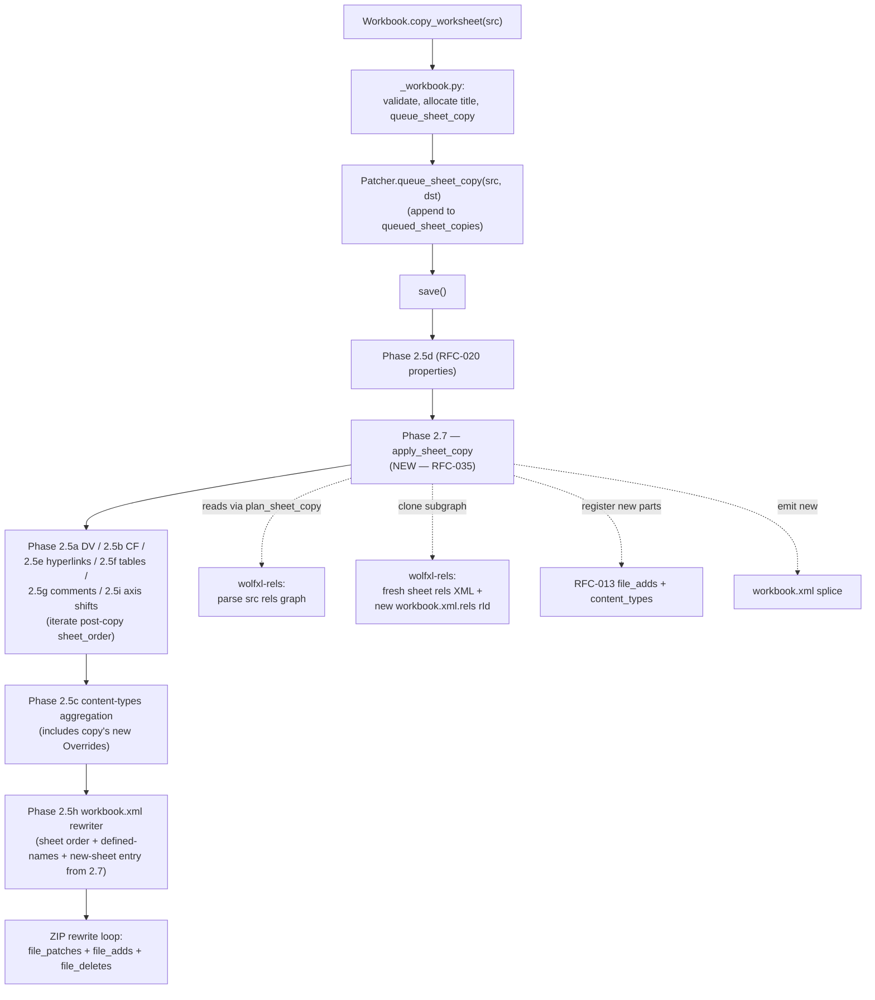

# RFC-035: `Workbook.copy_worksheet` (clone an existing sheet within a workbook)

Status: Shipped
Owner: pod-035
Phase: 4
Estimate: XL
Depends-on: RFC-010, RFC-012, RFC-013, RFC-021, RFC-022, RFC-023, RFC-024, RFC-025, RFC-026
Unblocks: —

> **S** = ≤2 days; **M** = 3-5 days; **L** = 1-2 weeks; **XL** = 2+ weeks
> (calendar, with parallel subagent dispatch + review).
>
> RFC-035 is the **single XL on the Phase 4 critical path**. Every RFC
> in Phase 2 + Phase 3 is a dependency: copy_worksheet is the first
> caller that has to clone an entire **sheet subgraph** (sheet XML +
> ancillary parts + rels + content-types + workbook entry +
> defined-name fan-out) atomically inside `do_save`. The spec below is
> deliberately long because every dependency contributes a constraint;
> implementation can be sliced (§7) but the spec must walk all of them
> in one place.

## 1. Goal (Problem Statement)

`python/wolfxl/_workbook.py:289-300` is a hard stub:

```python
def copy_worksheet(self, source: Worksheet) -> Worksheet:
    """Duplicate *source* into a new sheet within this workbook.

    Tracked by RFC-035 (Phase 4 / WolfXL 1.1). See
    ``Plans/rfcs/035-copy-worksheet.md`` for the implementation plan.
    """
    raise NotImplementedError(
        "Workbook.copy_worksheet is scheduled for WolfXL 1.1 (RFC-035). "
        "See Plans/rfcs/035-copy-worksheet.md for the implementation plan. "
        "Workaround: use openpyxl for structural ops, then load the result "
        "with wolfxl.load_workbook() to do the heavy reads."
    )
```

The openpyxl signature it shadows is `Workbook.copy_worksheet(self,
from_worksheet)` (see §3). User code:

```python
wb = wolfxl.load_workbook("dashboard.xlsx", modify=True)
src = wb["Template"]
new_ws = wb.copy_worksheet(src)            # NotImplementedError today
new_ws.title = "Q1 2026"
wb.save("dashboard.xlsx")
```

…lands on the stub.

**Target behaviour**: clone the source sheet into a brand-new sheet
appended at the end of the tab list. The clone duplicates **everything
the source carries**: cell values + styles, merged cells, dimension,
column/row metadata, formulas (translated only where necessary —
formulas without sheet qualifiers naturally re-target the new sheet),
hyperlinks (sheet rels + `<hyperlinks>` block), comments + VML
drawings (their own ancillary parts; allocated fresh numeric IDs),
tables (with auto-renamed `name` to keep workbook uniqueness), data
validations, conditional formatting (with their own dxf entries), and
sheet-scoped defined names (with `localSheetId` re-pointed to the new
sheet's tab index). Workbook-scope formulas/defined names/external
references that mention the source sheet by name continue to resolve
to the **source** sheet (not the copy) — see §5.4 for the
defined-name scope rule.

The default new title is `"<source.title> Copy"` (matches openpyxl —
§3); collisions get a numeric suffix (`"Template Copy 1"`,
`"Template Copy 2"`, …). The Python coordinator returns the new
`Worksheet` instance, which the user can rename via `new_ws.title =
"…"` (rename-an-existing-sheet is its own future RFC; the freshly
created sheet has a writable title because it was JUST created in
this session).

The empty-queue invariant from RFC-013 §8 applies: a `save()` with no
`copy_worksheet` calls produces a byte-identical save (no sheet
clones, no rels growth, no content-types churn).

## 2. OOXML Spec Surface

A "copy" of a sheet in ECMA-376 terms is the addition of a fresh
`<sheet>` entry in `xl/workbook.xml` plus a fresh part for every part
referenced by the source sheet's rels subgraph. Every numeric file
suffix that distinguishes parts (`sheet3.xml`, `comments2.xml`,
`vmlDrawing4.vml`, `table7.xml`, `drawing1.xml`, `image5.png`) is
**workbook-scoped** — Excel does not allow two parts of the same kind
to share a numeric suffix. Adding a sheet copy therefore requires
re-allocating every dependent part's suffix.

The OOXML surface RFC-035 must clone or register:

| Spec section | Element / file | Notes |
|---|---|---|
| §15.2 OPC — Relationships | `xl/worksheets/_rels/sheetN.xml.rels` | Cloned subgraph for the new sheet (one rels file per sheet copy). RFC-010 owns the parser/serializer. |
| §10.1 OPC — Content Types | `[Content_Types].xml` | New `<Override>` per cloned non-sheet part (comments, tables, vmlDrawing has Default by extension, drawings, others). RFC-013 owns the registry. |
| §18.2.27 CT_Workbook | `xl/workbook.xml` `<sheets>` | Append a new `<sheet name r:id sheetId/>` child. `r:id` references a new entry in `xl/_rels/workbook.xml.rels`; `sheetId` is workbook-unique (allocate `max(existing) + 1`). |
| §18.3.1.99 CT_Worksheet | `xl/worksheets/sheetN.xml` | Source bytes are cloned verbatim (with one explicit rewrite — the `<tableParts>` block's `r:id` attributes get the new sheet rels' rIds, see §5.2). |
| §18.5.1.2 CT_Table | `xl/tables/tableN.xml` | Cloned verbatim except: `id` attribute (workbook-unique table id), `name` and `displayName` (auto-renamed for uniqueness, §5.5). |
| §18.7.3 CT_Comments | `xl/comments<N>.xml` | Cloned verbatim. |
| Drawing.vml legacy | `xl/drawings/vmlDrawing<N>.vml` | Cloned verbatim (anchors are tied to col/row of the cloned sheet, which has the same coords — no shifts). |
| §20.4 DrawingML | `xl/drawings/drawing<N>.xml` | Cloned verbatim if present. |
| §15.2 OPC | `xl/media/image<N>.{png,jpg,…}` | **Aliased**, NOT cloned (§5.3, §8 risk #2). Drawing parts in the copy still point at the original image part. |
| §18.2.5 CT_DefinedName | `xl/workbook.xml` `<definedName>` | For each source-sheet-scoped defined name (`localSheetId == src_idx`), emit a fresh entry with `localSheetId == new_idx`. Workbook-scope names are left alone. |
| §18.3.1.20 CT_CalcPr | `xl/calcChain.xml` | NOT touched. After copy, the calc chain entries for the new sheet's cells are missing; Excel transparently rebuilds the chain on next open. (See §10 — out of scope.) |
| §18.6 PivotCache, §20.5 Chart | `xl/charts/`, `xl/pivotCache*` | Out of scope (§10). Drawings that reference a chart will alias the chart part the same way images alias. |

**Schema-ordering constraint** for `xl/workbook.xml`: `<sheets>` must
come before `<definedNames>`. The new sheet's `<sheet>` child appends
to the end of `<sheets>`; the new defined-name children append to the
end of `<definedNames>`. Both phases compose with RFC-021's
defined-name merger and RFC-036's sheet-order rewriter (the existing
streaming-splice merger reads workbook.xml once, applies all
workbook.xml mutations, and writes back).

## 3. openpyxl Reference

`/opt/homebrew/lib/python3.14/site-packages/openpyxl/workbook/workbook.py:397-414`:

```python
def copy_worksheet(self, from_worksheet):
    """Copy an existing worksheet in the current workbook

    .. warning::
        This function cannot copy worksheets between workbooks.
        worksheets can only be copied within the workbook that they belong

    :param from_worksheet: the worksheet to be copied from
    :return: copy of the initial worksheet
    """
    if self.__write_only or self._read_only:
        raise ValueError("Cannot copy worksheets in read-only or write-only mode")

    new_title = u"{0} Copy".format(from_worksheet.title)
    to_worksheet = self.create_sheet(title=new_title)
    cp = WorksheetCopy(source_worksheet=from_worksheet, target_worksheet=to_worksheet)
    cp.copy_worksheet()
    return to_worksheet
```

…and `openpyxl/worksheet/copier.py` (the full body — 65 LOC):

```python
class WorksheetCopy:
    def __init__(self, source_worksheet, target_worksheet):
        self.source = source_worksheet
        self.target = target_worksheet
        self._verify_resources()

    def _verify_resources(self):
        if (not isinstance(self.source, Worksheet)
            and not isinstance(self.target, Worksheet)):
            raise TypeError("Can only copy worksheets")
        if self.source is self.target:
            raise ValueError("Cannot copy a worksheet to itself")
        if self.source.parent != self.target.parent:
            raise ValueError('Cannot copy between worksheets from different workbooks')

    def copy_worksheet(self):
        self._copy_cells()
        self._copy_dimensions()
        self.target.sheet_format     = copy(self.source.sheet_format)
        self.target.sheet_properties = copy(self.source.sheet_properties)
        self.target.merged_cells     = copy(self.source.merged_cells)
        self.target.page_margins     = copy(self.source.page_margins)
        self.target.page_setup       = copy(self.source.page_setup)
        self.target.print_options    = copy(self.source.print_options)

    def _copy_cells(self):
        for (row, col), source_cell in self.source._cells.items():
            target_cell = self.target.cell(column=col, row=row)
            target_cell._value    = source_cell._value
            target_cell.data_type = source_cell.data_type
            if source_cell.has_style:    target_cell._style = copy(source_cell._style)
            if source_cell.hyperlink:    target_cell._hyperlink = copy(source_cell.hyperlink)
            if source_cell.comment:      target_cell.comment = copy(source_cell.comment)

    def _copy_dimensions(self):
        for attr in ('row_dimensions', 'column_dimensions'):
            src    = getattr(self.source, attr)
            target = getattr(self.target, attr)
            for key, dim in src.items():
                target[key] = copy(dim)
                target[key].worksheet = self.target
```

**Behavioural notes**:

- Default title format: `"{source.title} Copy"` (`workbook.py:410`).
  No suffix on the first copy; collisions are resolved by
  `create_sheet`'s own dedup loop (which appends ` 1`, ` 2`, … —
  `workbook.py:create_sheet`).
- Disallowed in read-only and write-only modes (`workbook.py:407-408`).
  WolfXL has different mode semantics (read-only is `wolfxl.load_workbook(p)`
  without `modify=True`; write-only is `Workbook()`); see §4.1 for the
  WolfXL-side precondition.
- `WorksheetCopy._copy_cells` walks the in-memory cell dict and copies
  values + style + hyperlink + comment per cell. wolfxl operates on
  on-disk XML, not an in-memory dict — see "what we do NOT copy"
  below for the architectural divergence.
- Cross-workbook copy is rejected (`copier.py:32-33`). RFC-035
  matches: §2 OOS lists cross-workbook as out of scope.
- The copy operation does **not** clone tables, data validations,
  conditional formatting, or defined names — openpyxl's
  `WorksheetCopy` quietly **drops** them. WolfXL deliberately diverges
  here (we clone all of these); see §7 cross-mode notes and §8 risk
  #5.
- The copy operation does **not** re-target sheet-scoped defined
  names. Same divergence as RFC-036 (move_sheet) — wolfxl fixes the
  bug.

**What we do NOT copy from openpyxl**:

- The `WorksheetCopy` class structure. WolfXL's modify-mode patcher
  has no in-memory cell dict; the entire copy happens server-side in
  Rust by cloning ZIP entries and rels subgraphs. The architectural
  shape is closer to "ZIP-level part duplication + rewrite the ID
  fields" than to "walk the in-memory model and re-emit".
- The `_copy_dimensions` per-key clone loop. WolfXL clones
  `<cols>` and `<row>` data implicitly via the source-sheet-XML clone
  (those elements are children of `<sheetData>` / siblings in
  `CT_Worksheet`).
- The `copy.copy(...)` Python-level shallow clones. These are
  irrelevant to the patcher path; we operate on bytes.
- openpyxl's silent-drop of tables / DV / CF / sheet-scoped names —
  WolfXL clones them.

## 4. WolfXL Surface Area (Architecture)

### 4.1 Python coordinator

File: `python/wolfxl/_workbook.py:289-300`. Replace the
`NotImplementedError` body with:

1. Type-check: `source` must be a `Worksheet` instance; reject
   strings (openpyxl rejects strings too — the param is a worksheet
   object). Reject if `source._workbook is not self` (cross-workbook
   copy — also matches openpyxl).
2. **Mode precondition**: `copy_worksheet` is **modify-mode-only** in
   the first slice (§3 open question (a) below). Raise a clear
   `NotImplementedError("write-mode copy_worksheet is RFC-XXX")` for
   write-mode workbooks. Read-only mode (`load_workbook` without
   `modify=True`) raises `RuntimeError` because there is no patcher
   or writer to record the copy on. See §3 OQ-a for the rationale and
   the alternative.
3. Compute the new title: `f"{source.title} Copy"` initially. If that
   collides with an existing sheet name in `self._sheet_names`, append
   ` 1`, ` 2`, … until unique. (Same algorithm `create_sheet` uses.)
4. Allocate the new `Worksheet` Python object: append to
   `self._sheet_names`, store in `self._sheets[new_title]`, instantiate
   `Worksheet(self, new_title)`. Mark the worksheet as
   `_is_copy=True` and stash the source title on `_copy_source_title`
   so the patcher can locate the source sheet bytes at flush time.
5. Queue the copy on the patcher: `self._rust_patcher.queue_sheet_copy(
   src_title, new_title)`. The patcher records it on
   `queued_sheet_copies: Vec<(String, String)>`. Phase 2.7 (the new
   one — see §4.2) drains it during `do_save`.
6. Return the new `Worksheet`. The user may then call
   `new_ws["A1"] = ...`, set hyperlinks, queue table edits, etc. —
   all of which flow through the existing per-sheet flush paths
   targeting the copy's name. Edits to the copy in the SAME save()
   are layered on top of the cloned bytes (Phase 2.7 runs early
   enough that downstream Phase 2.5* phases see the clone as "an
   existing sheet" — see §5 phase-ordering).

A new flush method is **not** needed (matches RFC-036's pattern):
`queue_sheet_copy` is invoked eagerly inside `copy_worksheet`. The
existing `save()` orchestrator just runs the patcher's drain loop;
Phase 2.7 picks up `queued_sheet_copies` automatically.

### 4.2 Patcher (modify mode)

The patcher gains:

**New field on `XlsxPatcher`** (`src/wolfxl/mod.rs`):

```rust
/// (src_title, dst_title) in user-call order. Drained by Phase 2.7.
queued_sheet_copies: Vec<(String, String)>,
```

**New PyMethod**: `fn queue_sheet_copy(&mut self, src_title: &str,
dst_title: &str) -> PyResult<()>`. Validates that `src_title` is in
`self.sheet_order`. Pushes onto the queue.

**New module**: `src/wolfxl/sheet_copy.rs` — the orchestrator. Public
API:

```rust
/// Plan a single sheet copy. Pure: takes the patcher's current view
/// of source bytes + rels graphs + content-types graph + sheet_order
/// and returns the set of mutations to apply.
///
/// Does NOT mutate the patcher; the caller (Phase 2.7) atomically
/// applies the returned mutations.
pub struct SheetCopyPlan<'a> {
    pub src_title: &'a str,
    pub dst_title: &'a str,
    pub src_sheet_path: &'a str,             // "xl/worksheets/sheet3.xml"
    pub src_sheet_xml: &'a [u8],
    pub src_rels_xml: Option<&'a [u8]>,      // None if sheet has no rels
    pub workbook_rels_xml: &'a [u8],
    pub workbook_xml: &'a [u8],
    pub content_types_xml: &'a [u8],
    pub source_zip_listing: &'a [String],    // every entry in the source ZIP
    pub file_adds_listing: &'a [String],     // entries already added in this save
    pub patches_listing: &'a [String],       // entries already patched in this save
    pub existing_table_names: &'a [String],  // every table name in the workbook
    pub existing_table_ids: &'a [u32],       // every <table id="N"> in the workbook
}

pub struct SheetCopyMutations {
    /// New sheet entry. `path` is the workbook-unique sheet path.
    pub new_sheet_path: String,
    pub new_sheet_xml: Vec<u8>,

    /// New rels file. Empty `Vec<u8>` means no rels file is emitted
    /// (source sheet had no rels of its own).
    pub new_rels_path: Option<String>,
    pub new_rels_xml: Option<Vec<u8>>,

    /// New ancillary parts (comments, vml, tables, drawings).
    /// Each entry: (zip path, bytes). Image parts are NOT in this
    /// list — they are aliased (§5.3).
    pub new_ancillary_parts: Vec<(String, Vec<u8>)>,

    /// Content-type Override / Default ops.
    pub content_type_ops: Vec<content_types::ContentTypeOp>,

    /// New rId for the workbook.xml.rels entry pointing at the
    /// new sheet, plus the rewritten workbook rels XML.
    pub new_workbook_rels_xml: Vec<u8>,

    /// Rewritten workbook.xml: appends the <sheet> child plus any
    /// new sheet-scoped <definedName> entries.
    pub new_workbook_xml: Vec<u8>,

    /// New <sheet sheetId> for caller bookkeeping (advances
    /// patcher.sheet_order in lockstep).
    pub new_sheet_tab_index: u32,
}

pub fn plan_sheet_copy<'a>(plan: SheetCopyPlan<'a>) -> Result<SheetCopyMutations, String>;
```

**Phase 2.7 — `apply_sheet_copy`** (new, in `do_save`): drains
`queued_sheet_copies` in append order. For each `(src, dst)`:

1. Build a `SheetCopyPlan` from current patcher state (`file_patches`
   + `file_adds` if already mutated, source ZIP otherwise).
2. Call `sheet_copy::plan_sheet_copy(plan)`.
3. Apply mutations:
   - Insert `new_sheet_xml` into `file_adds` at `new_sheet_path`.
   - Insert `new_rels_xml` (if any) into `file_adds`.
   - Insert each `new_ancillary_parts` entry into `file_adds`.
   - For each `content_type_ops` entry, push onto
     `queued_content_type_ops` (which Phase 2.5c flushes — see §5
     phase-ordering: 2.7 must run BEFORE 2.5c).
   - Replace `file_patches["xl/_rels/workbook.xml.rels"]` with
     `new_workbook_rels_xml`.
   - Replace `file_patches["xl/workbook.xml"]` with `new_workbook_xml`.
   - Append `dst_title` to `self.sheet_order`.
   - Insert `(dst_title, new_sheet_path)` into `self.sheet_paths`.
4. Move on to the next queued copy. The next iteration sees the
   mutated state — copies of copies and copies-with-edits work.

**Phase ordering** (`do_save`): the new Phase 2.7 must sequence
**before** every per-sheet phase that walks `sheet_order` (Phase 2.5a
DV, 2.5b CF, 2.5e hyperlinks, 2.5f tables, 2.5g comments, 2.5i axis
shifts) so downstream phases iterate the post-copy sheet list. It must
also run **before** Phase 2.5c (content-types aggregation) and Phase
2.5h (sheet-order/defined-names workbook.xml rewriter) so those phases
see the post-copy `[Content_Types].xml` and post-copy `<sheets>` /
`<definedNames>` content. The numeric label "2.7" places it between
2.6 (none currently) and 2.5*; we will rename "2.7" → "2.45" or
similar to keep the lexicographic ordering meaningful — final naming
is an implementation detail.



### 4.3 Native writer (write mode)

**No write-mode surface this slice.** Write-mode workbooks are
constructed with `Workbook()` cell-by-cell; the writer's emit pipeline
already supports adding sheets via `Workbook.create_sheet(title=...)`.
A write-mode `copy_worksheet` would have to walk the in-memory writer
model (cells + styles + tables + DV + CF + hyperlinks + comments +
defined names) and clone every dataclass — a different code path
entirely. Whether to ship that path is §3 open question (a). The
default in this RFC is **modify-mode-only**; the write-mode path is
deferred to a follow-up RFC.

The asymmetry is loud and documented in §7.

## 5. Implementation Sketch (Detailed Steps)

### 5.1 Sheet XML clone

The source sheet's bytes (`xl/worksheets/sheet<src>.xml`) are
**copied verbatim** with exactly **one** rewrite:

- `<tableParts>`: each `<tablePart r:id="rIdN"/>` child's `r:id`
  attribute is rewritten to point at the new rels graph's allocated
  rIds. The mapping `old_rid → new_rid` is built when the rels
  subgraph is cloned (§5.3).

Everything else flows through unchanged:

- `<row>` / `<c>` / `<f>` — coordinates and formulas are valid in the
  copy because the copy occupies the same coordinate space as the
  source. Formulas like `=A1+B1` still resolve to the cells inside
  the new sheet (Excel's "this sheet" qualifier is implicit).
- `<dimension>` — same range as source (`A1:E10` is still the right
  bounding box for the copy's data).
- `<mergeCell>`, `<hyperlink>`, `<dataValidation>`,
  `<conditionalFormatting>` — sqref / ref / formula1 / formula2 are
  all coordinate-only and don't depend on sheet identity.
- `<legacyDrawing r:id="…">` — rewritten the same way as
  `<tableParts>` if present (the rId points at the cloned vmlDrawing
  part).
- `<drawing r:id="…">` — rewritten if present (points at the cloned
  drawing part).
- `<picture r:id="…">` — rewritten if present.

**Why no formula translator pass**: RFC-012's translator rewrites
coordinate references when the **coordinate space** changes
(insert/delete row/col). A sheet copy preserves the source's
coordinate space, so cell-local refs (`A1`, `$B$2`, `Sheet1!A1`)
need no rewrite. The exception is the rare case where a formula
inside the **source** sheet uses an absolute sheet qualifier pointing
at itself (e.g. cell `B2` on `"Template"` containing
`='Template'!A1`); after the copy, the cell `B2` on the new sheet
would read `='Template'!A1` — i.e. it cross-sheets back to the
source. This **matches Excel's behaviour** (Excel's copy-tab UI
preserves explicit `Sheet1!` qualifiers), so we leave the formula
text alone. This is documented as a §10 known divergence ("formula
text references to the source sheet's name resolve to the source,
not the copy").

**Sheet `r:id` and `sheetId`**: the new `<sheet>` child in
`xl/workbook.xml` gets a fresh `r:id` from RFC-010's allocator on the
workbook rels graph; `sheetId` is `max(existing_sheet_ids) + 1`.

**New sheet path**: `xl/worksheets/sheet<N>.xml` where `N` is
`(highest_existing_sheet_path_index) + 1`. This is the path used in
`<Override>` and in the `Target` of the workbook.xml.rels entry.

### 5.2 Ancillary parts (tables, comments, VML, drawings)

For each part the source sheet's rels graph references that lives
**inside the workbook ZIP** (i.e. not external like a hyperlink URL),
the patcher emits a freshly numbered clone:

| Source rel type | Source path | Cloned path | Notes |
|---|---|---|---|
| `RT_TABLE` | `xl/tables/tableK.xml` | `xl/tables/tableK'.xml` | `K' = (max_existing_table_idx) + 1`. Table `id`, `name`, `displayName` are rewritten — see §5.5. |
| `RT_COMMENTS` | `xl/comments<C>.xml` | `xl/comments<C'>.xml` | `C' = (max_existing_comments_idx) + 1`. Cloned verbatim. |
| `RT_VML_DRAWING` | `xl/drawings/vmlDrawing<V>.vml` | `xl/drawings/vmlDrawing<V'>.vml` | `V' = (max_existing_vml_idx) + 1`. Cloned verbatim. |
| `RT_DRAWING` | `xl/drawings/drawing<D>.xml` | `xl/drawings/drawing<D'>.xml` | `D' = (max_existing_drawing_idx) + 1`. Cloned verbatim, but rels-rewritten if drawing has its own rels file (drawingN.xml.rels) — see §5.3. |
| `RT_PRINTER_SETTINGS` | `xl/printerSettings/printerSettings<P>.bin` | `xl/printerSettings/printerSettings<P'>.bin` | Cloned verbatim. |
| `RT_OLE_OBJECT` | `xl/embeddings/oleObject<O>.bin` | NOT cloned | Out of scope; preserved-on-source aliased. (See §10.) |

**Centralized part-ID allocator** (§8 risk #1): the part-suffix
allocator is a single struct living in `crates/wolfxl-rels`:

```rust
pub struct PartIdAllocator {
    next_table_idx: u32,
    next_comments_idx: u32,
    next_vml_idx: u32,
    next_drawing_idx: u32,
    next_printer_idx: u32,
    next_sheet_idx: u32,
}

impl PartIdAllocator {
    /// Build by scanning the source ZIP listing once at the start of
    /// Phase 2.7. After scanning every `xl/{tables,comments,
    /// drawings,worksheets,printerSettings}/*` filename, `next_*_idx`
    /// is `(max_seen + 1)`. Treat `file_adds` and `file_patches` as
    /// also-existing for collision-avoidance.
    pub fn from_zip_listing(...) -> Self;

    pub fn alloc_table(&mut self) -> u32;
    pub fn alloc_comments(&mut self) -> u32;
    pub fn alloc_vml(&mut self) -> u32;
    pub fn alloc_drawing(&mut self) -> u32;
    pub fn alloc_printer(&mut self) -> u32;
    pub fn alloc_sheet(&mut self) -> u32;
}
```

The allocator is **constructed fresh per save** (since multiple copies
in one save share the allocator and must not collide), and is owned by
the `apply_sheet_copy` orchestrator.

### 5.3 Rels graph clone (the subgraph rooted at the source sheet)

The rels graph is the heart of the copy. RFC-035 walks the **rels
subgraph** rooted at the source sheet and produces a parallel subgraph
for the new sheet.

**Subgraph walk algorithm** (per source sheet):

1. Parse `xl/worksheets/_rels/sheet<src>.xml.rels` via
   `wolfxl_rels::RelsGraph::parse`. If the source sheet has no rels
   file, the subgraph is empty (no ancillary parts to clone) — done.
2. Build a **fresh** `RelsGraph::new()` for the destination sheet.
   For each `Relationship` in the source graph, decide:

   | Source rel | Action |
   |---|---|
   | `RT_TABLE`, `RT_COMMENTS`, `RT_VML_DRAWING`, `RT_DRAWING`, `RT_PRINTER_SETTINGS` | Clone the target part to a freshly-allocated path (§5.2). Add a new `Relationship` to the destination rels graph with `Target` pointing at the cloned path. Record the `(old_rid → new_rid)` mapping for the §5.1 sheet-XML rewrite. |
   | `RT_HYPERLINK` (`TargetMode::External`) | Add a new `Relationship` to the destination rels graph with the same `Target` URL. **No** part-clone (external URLs are not files in the ZIP). The new rId differs from the old rId because monotonic allocation never re-uses; rels parity preserves the URL. |
   | `RT_HYPERLINK` (`TargetMode::Internal`, e.g. internal sheet jumps that for some reason get a rels entry — rare; most internal hyperlinks live in the `<hyperlink location="…"/>` attribute, not as rels) | Add a new `Relationship` with the same target. |
   | `RT_OLE_OBJECT` | OOS this slice (§10). Surface a warning; emit a placeholder rels entry pointing at the original OLE part (alias) — the result is that the copy's OLE object is the **same** binary as the source's, which is what users expect for read-only embedded files. |
   | Anything else (unknown rel type) | Alias (don't clone), preserve the rels entry. |

3. Drawings have their own rels file (`xl/drawings/_rels/
   drawing<D>.xml.rels`). When a drawing is cloned, its rels file
   must also be cloned **AND** its sub-rels rewritten. Specifically,
   drawing rels reference `RT_IMAGE` parts (`xl/media/image<I>.{ext}`)
   and possibly `RT_CHART` / `RT_HYPERLINK` parts. Per §5.3 alias
   rule, image parts are **aliased** (not cloned) — see §8 risk #2.
   The cloned drawing rels file therefore has fresh rIds but `Target`
   values pointing at the **original** image paths.

4. **Image aliasing rationale**: an `xl/media/image1.png` is typically
   1 KB to 5 MB and is shared by every cell that references it. If we
   cloned the binary on every sheet copy, a workbook with a logo
   image and 50 sheet copies would bloat 50× for no gain. Excel and
   LibreOffice both accept multiple drawing parts pointing at the
   same image binary. The risk (§8) is that a future "modify a copy's
   image without affecting the source" workflow would silently mutate
   the source — but no current API exposes per-cell image mutation in
   modify mode, so the risk is theoretical for 1.1.

5. The **destination rels graph** is serialized via
   `RelsGraph::serialize()` and emitted as a brand-new
   `xl/worksheets/_rels/sheet<N>.xml.rels` entry through `file_adds`.

**Workbook-rels update** (separate rels graph,
`xl/_rels/workbook.xml.rels`): a new `Relationship` of type
`RT_WORKSHEET` is added pointing at the new sheet's path. This rId is
the value used in the new `<sheet r:id="…">` child of `<sheets>`.

### 5.4 Defined-name `localSheetId` rewrite

**Scope rule** (§3 open question (c) resolution proposal): when a
source-sheet has sheet-scoped defined names, the COPY gets fresh
defined-name entries with `localSheetId == new_idx`. The original
sheet-scoped names on the source are NOT touched.

Algorithm (in Phase 2.7, before handing workbook.xml to the §5.7
splicer):

1. Compute `src_idx = sheet_order.index_of(src_title)` (the position
   of the source in the **pre-copy** tab list).
2. Compute `new_idx = sheet_order.len()` (the position the copy will
   occupy when appended).
3. Parse `xl/workbook.xml`'s `<definedNames>` block. For each
   `<definedName>` whose `localSheetId == src_idx`, emit a fresh
   sibling entry with all attributes copied verbatim, **except**
   `localSheetId`, which becomes `new_idx`. The formula text is
   verbatim (sheet copies share coordinate space; sheet-scoped names
   reference cells by coords, not by sheet name).
4. Workbook-scope names (no `localSheetId` attribute) are **not**
   duplicated. They continue to apply workbook-wide.
5. Names whose formula text mentions `'<src_title>'!` by name still
   resolve to the source sheet, not the copy. This matches Excel's
   "copy-tab" UI: explicit sheet qualifiers are literal and don't
   re-target. (The user can rename the copy and rebuild the formula
   manually if needed.)

The fresh defined-name entries are **appended** to the existing
`<definedNames>` block (preserving source-order for stability).

**Composability with RFC-021** (defined-name merger): RFC-021's merger
already handles upserting `<definedName>` entries. Phase 2.7's
defined-name additions go through the **same merger** — Phase 2.7
queues them on `queued_defined_names` (using
`queue_defined_name(payload)` internally), and Phase 2.5f's drain runs
them through `merge_defined_names` exactly like a user-queued name.
This avoids re-implementing the workbook.xml splice.

**Composability with RFC-036** (move_sheet): if the user copies a
sheet AND moves a sheet in the same `save()`, the sequencing is
copy-first (Phase 2.7) then move (Phase 2.5h). After Phase 2.7 runs,
`sheet_order` already contains the new sheet at the end; Phase 2.5h's
move computes the remap table relative to the post-copy tab list. The
two phases compose correctly because Phase 2.5h reads workbook.xml
once and does the reorder + localSheetId remap as a single splice.

### 5.5 Table name uniqueness

Tables have a workbook-wide `name` uniqueness constraint (RFC-024 §3
notes that openpyxl raises on collision). When the source sheet has a
table named `Sales`, the cloned table cannot also be named `Sales` —
Excel will refuse to open the file.

**Algorithm** (§3 open question (b) resolution proposal):

```
existing = set of every table name in the workbook (scanned at the
           start of Phase 2.7, including any tables already-queued in
           queued_tables but not yet flushed)
for each source-table being cloned:
    base = source.name           # e.g. "Sales"
    suffix = 2                   # NOT 1 — convention is "Sales", "Sales2", "Sales3"
    candidate = f"{base}_{suffix}"
    while candidate in existing:
        suffix += 1
        candidate = f"{base}_{suffix}"
    new_name = candidate
    existing.add(new_name)       # so a 2nd copy in the same session gets _3 not _2
```

Rationale for the `_{N}` separator (rather than just appending the
number): Excel's UI uses underscore-prefixed numerics for auto-renamed
tables in some locales; the underscore avoids ambiguity with names
that already end in digits (`Sales2024` → `Sales2024_2` rather than
the surprising `Sales20242`). This is the resolution proposed for
§3 OQ-b; final wording is approved before implementation.

The same rule applies to `displayName` (which is usually equal to
`name` and follows the same uniqueness constraint per ECMA-376).

The auto-renamed table's **`<table id="K'">`** is also fresh (allocated
via `PartIdAllocator::alloc_table` — §5.2 / §8 risk #1). Table column
ids (`<tableColumn id="N">`) are **table-local** and are unchanged.

### 5.6 `[Content_Types]` override list update

For every cloned non-sheet part, an `<Override>` entry is added to
`[Content_Types].xml`. The mapping:

| Cloned part | Content-Type URI | RFC-013 op |
|---|---|---|
| `xl/worksheets/sheetN.xml` | `application/vnd.openxmlformats-officedocument.spreadsheetml.worksheet+xml` | `add_override` |
| `xl/comments<C'>.xml` | `application/vnd.openxmlformats-officedocument.spreadsheetml.comments+xml` | `add_override` |
| `xl/tables/table<K'>.xml` | `application/vnd.openxmlformats-officedocument.spreadsheetml.table+xml` | `add_override` |
| `xl/drawings/vmlDrawing<V'>.vml` | (NONE — uses Default `vml` extension) | `ensure_default("vml", ...)` |
| `xl/drawings/drawing<D'>.xml` | `application/vnd.openxmlformats-officedocument.drawing+xml` | `add_override` |
| `xl/printerSettings/printerSettings<P'>.bin` | (Default `bin` extension) | `ensure_default("bin", ...)` |

These ops are pushed into `queued_content_type_ops` (RFC-013's queue)
during Phase 2.7. Phase 2.5c (content-types aggregation) then folds
them into the single `[Content_Types].xml` rewrite alongside any
user-queued ops (e.g. tables added directly to the new sheet via
`new_ws.add_table` after the copy).

### 5.7 `<sheets>` block append in workbook.xml

The new sheet entry is appended to the `<sheets>` block in
`xl/workbook.xml`:

```xml
<sheet name="Template Copy" sheetId="42" r:id="rId27"/>
```

- `name`: the deduped Python-side title (§4.1 step 3). XML-escaped.
- `sheetId`: `max(existing_sheet_ids) + 1`. This is **not** the same
  thing as the position index — sheetIds are stable across reorders
  (RFC-036 §2). Position is determined by document order.
- `r:id`: the rId allocated by RFC-010 on the **workbook** rels graph
  (`xl/_rels/workbook.xml.rels`) for the new sheet's worksheet
  relationship.

Phase 2.7 produces a rewritten `xl/workbook.xml` byte stream with:

- The new `<sheet>` appended to the end of `<sheets>`.
- For each source sheet-scoped `<definedName>`, a fresh sibling
  appended to `<definedNames>` (§5.4).

This rewrite is implemented as a **streaming splice** (same idiom as
RFC-021 / RFC-036): scan workbook.xml once, locate the byte range of
`</sheets>` (insertion point) and `</definedNames>` (or insertion
point if absent), splice the new bytes in, copy everything else
verbatim. The rewrite is composable with RFC-021/036 because all
three phases produce/consume the same byte-stream model.

### 5.8 No-op invariant

If `queued_sheet_copies.is_empty()` at the start of Phase 2.7, the
phase short-circuits and produces zero mutations. Combined with the
existing `do_save` short-circuit guard (RFC-013 §8), a `save()` with
no `copy_worksheet` calls produces a byte-identical save. The guard
predicate gains `&& self.queued_sheet_copies.is_empty()`.

### 5.9 Validation

The Python coordinator validates (eager, not at save-time):

- `source` is a `Worksheet` instance. Otherwise `TypeError`.
- `source._workbook is self`. Otherwise `ValueError`
  ("Cannot copy between worksheets from different workbooks").
- The workbook is in modify mode (write-mode is OQ-a; if not
  shipped, raise `NotImplementedError` with a §3 pointer).

The Rust patcher validates (also eager, at queue time):

- `src_title` is in `self.sheet_order`. Otherwise `KeyError`.
- `dst_title` is NOT in `self.sheet_order` (Python coordinator
  guarantees this via the dedup loop, but the patcher double-checks).

## 6. Verification Matrix (six-layer)

| Layer | Coverage |
|---|---|
| 1. Rust unit tests (`cargo test -p wolfxl-rels`, inline tests in `src/wolfxl/sheet_copy.rs`) | ≥ 25 cases. Subgraph walk on a sheet with: only cells; cells + tables; cells + comments + VML; cells + drawings + images (alias check); cells + DV + CF (no rels effect, but verify clone passes through). PartIdAllocator allocation with gaps, with file_adds collisions, with patches collisions. Table-name dedup with a base name that already has digits (`Sales2024`). Defined-name `localSheetId` rewrite for src-scope and unrelated-scope names. Empty queue → identity. |
| 2. Golden round-trip (diffwriter) | `tests/diffwriter/cases/copy_worksheet.py` opens a multi-sheet fixture with at least one table + one comment + one external hyperlink + one sheet-scoped defined name, calls `wb.copy_worksheet(wb["Template"])`, saves under `WOLFXL_TEST_EPOCH=0`, asserts byte-equal to a checked-in golden. Generate the golden once, manually inspect with `unzip -l` and ECMA-376-aware spot checks. |
| 3. openpyxl parity (`tests/parity/`) | New test `tests/parity/test_copy_worksheet_parity.py`. Open a fixture; call `wb.copy_worksheet(...)` with both wolfxl and openpyxl; save both; re-read both with openpyxl. Compare cell values, merged cells, dimensions, page setup. **Expected divergences** (loud, ratchet-tracked, NOT spurious failures): tables, DV, CF, sheet-scoped defined names — wolfxl clones; openpyxl drops. |
| 4. LibreOffice cross-renderer | Manual: `soffice --headless --convert-to xlsx <out.xlsx> --outdir /tmp/lo`; re-open the converted file with wolfxl; verify the cloned tables / DV / CF / comments are still present and unchanged. Capture screenshot of LibreOffice GUI showing both sheets in the tab bar. Add to PR description; do not gate CI. |
| 5. Cross-mode | N/A this slice — RFC-035 is modify-mode-only. The `Workbook.copy_worksheet` call in write mode raises `NotImplementedError`; verified in `tests/test_copy_worksheet_modify.py::test_write_mode_raises`. The cross-mode follow-up is its own RFC. |
| 6. Regression fixture | `tests/fixtures/035-copy-worksheet/source.xlsx` — a multi-sheet fixture with the full feature surface (tables + DV + CF + comments + VML + hyperlinks + sheet-scoped defined names + an external image), checked into git via `git lfs` if size permits else hand-built in-test. The "open + copy + save + reopen" round-trip test is the regression gate. |

The standardized "done" gate is `python scripts/verify_rfc.py --rfc
035 --quick` (the same script used by every prior RFC). RFC-035 must
also pass the existing `tests/parity/` sweep without regression
(currently 97 passed + 1 skipped baseline).

**Cross-cutting invariants asserted in tests**:

- `<table id>` values are workbook-unique post-copy (no two tables share
  an id).
- `<sheet sheetId>` values are workbook-unique post-copy.
- Every cloned ancillary part's filename is workbook-unique.
- `[Content_Types].xml` has an `<Override>` for every new non-VML part
  and the `vml` extension has a `<Default>`.
- The new sheet's rels graph parses cleanly through
  `wolfxl_rels::RelsGraph::parse` and round-trips byte-stable.
- The empty-queue save is byte-identical to source.

## 7. Implementation Plan (Phases / Effort Breakdown)

XL = ≥ 10 calendar days. Sliced into seven sub-phases:

| Phase | Estimate | Notes |
|---|---|---|
| 7.0 — Research / spec lock | 1 day | This document. Approval signoff on §3 open questions. |
| 7.1 — `PartIdAllocator` + rels-subgraph walker (`crates/wolfxl-rels` extension) | 1.5 days | Single-allocator scaffolding; pure-Rust unit tests. No patcher wiring yet. |
| 7.2 — `sheet_copy::plan_sheet_copy` orchestrator (Rust, `src/wolfxl/sheet_copy.rs`) | 2.5 days | Pure planner: takes inputs, returns mutations struct. ≥ 15 unit tests covering each rel-type branch + table dedup + defined-name rewrite. |
| 7.3 — Phase 2.7 wiring in `XlsxPatcher::do_save` | 1.5 days | Apply mutations, sequence with existing phases, update `sheet_order` + `sheet_paths`. PyMethod `queue_sheet_copy`. |
| 7.4 — Python coordinator (`_workbook.py:copy_worksheet`) | 1 day | Validation, title dedup, queue, return Worksheet. Mode precondition handling. |
| 7.5 — Test harness (`tests/test_copy_worksheet_modify.py`) | 2 days | ≥ 15 pytest cases covering: clean copy, copy with tables, copy with hyperlinks, copy with comments, copy with VML, copy with DV, copy with CF, copy with sheet-scoped defined names, copy + edit-the-copy in same save, copy + RFC-036 move in same save, copy + RFC-024 add-table-to-copy in same save, name collision, cross-workbook rejection, write-mode rejection, no-op byte-identical save. |
| 7.6 — Diffwriter golden + parity test + LibreOffice manual + ratchet plumbing | 1.5 days | Layer 2 / 3 / 4 of §6. |
| 7.7 — Verification + iteration | 1 day | Run `verify_rfc.py --rfc 035 --quick` until green; iterate on edge cases. |

**Total: 12 days.** Comfortably within XL bracket (≥ 10 days).

The slices are ordered so that 7.1 + 7.2 are mergeable independently
(pure Rust, no Python or PyO3), making them easy to ship as separate
commits behind the unwired `queue_sheet_copy` PyMethod. 7.3 is the
"wire it up" commit; 7.4 + 7.5 are the user-visible commit; 7.6 + 7.7
are the verification commits.

## 8. Risks

| # | Risk | Likelihood | Impact | Mitigation |
|---|---|---|---|---|
| 1 | **Part-ID collisions** if multiple subsystems allocate part IDs independently. RFC-024 (tables) and RFC-023 (comments) each have their own scanner today. RFC-035 introduces a third caller; if they don't share an allocator, two copies in the same save could pick the same suffix. | medium | high | Centralize all part-ID allocation in `PartIdAllocator` (`crates/wolfxl-rels`). Refactor RFC-024 + RFC-023 callers in Phase 7.1 to consume the same struct. Single source of truth; Rust unit tests assert no two `alloc_*` calls return the same value. |
| 2 | **Shared images / drawings via aliasing**: the rels graph for the copy points at the original `xl/media/image1.png`. If a future API mutates the copy's image (e.g. `new_ws.replace_image(...)`), the source's image gets clobbered. | medium | medium | Document the aliasing contract in `sheet_copy.rs` module docs. Mark "deep clone images" as a §10 follow-up. Add a regression test that asserts the copy's drawing rels point at the same `image*.png` path as the source's drawing rels — so any future change that breaks aliasing surfaces visibly. The current 1.1 surface has no per-image mutation API, so the risk is theoretical until a future RFC introduces one. |
| 3 | **openpyxl re-saving the wolfxl-generated copy** loses fidelity (openpyxl's `WorksheetCopy` drops tables / DV / CF / sheet-scoped names). This is the **parity blocker**. A user round-tripping through openpyxl would lose features the copy carried. | high | medium | Document the divergence loudly in `KNOWN_GAPS.md` + 1.1 release notes. Layer-3 parity test (§6) asserts wolfxl's behavior, not openpyxl's; expected divergence is ratchet-tracked, not a CI red. Users who NEED openpyxl-compat round-trip should either (a) stick with openpyxl for the copy step, or (b) call `wolfxl.load_workbook(p, modify=True).copy_worksheet(...).save(p)` end-to-end without an openpyxl save in the middle. |
| 4 | **`<tableParts r:id>` rewrite misses an attribute**: the `r:id` on `<tablePart>` and `<legacyDrawing>` and `<drawing>` and `<picture>` elements all need rewriting. If any one is missed, the cloned sheet's table or drawing or comment links are broken. | medium | high | Treat the rewrite as a **single rels-rId remap pass** over the cloned sheet XML rather than a per-element pass. The orchestrator builds the `(old_rid → new_rid)` map once (during the rels-subgraph clone — §5.3) and walks the cloned sheet XML with `quick_xml`, rewriting every `r:id="…"` attribute whose value is in the map. This is one code path, easy to test, hard to miss. |
| 5 | **Defined-name `localSheetId` indexing**: the `localSheetId` value depends on the **post-copy** tab list. If we compute it from the **pre-copy** list, every sheet at position ≥ src_idx gets the wrong index. | low | high | Compute `new_idx = sheet_order.len()` (BEFORE the append) explicitly; document the ordering rule in `sheet_copy.rs` module docs; unit test with a fixture that has source at position 0 and another sheet-scoped name at position 2 (assert position 2's name is unaffected). |
| 6 | **Table name auto-rename collides with a future `add_table`**: a user copies sheet "A" (with table `Sales`) producing `Sales_2`, then in the SAME save calls `new_ws.add_table(Table(name="Sales_2", ...))`. RFC-024's name-collision check currently scans the source ZIP only; it would miss the in-flight `Sales_2`. | low | medium | Phase 2.7 runs BEFORE Phase 2.5f (tables). At Phase 2.5f's collision scan, the existing-names set is built from `(source-zip table names) ∪ (queued_tables for THIS sheet) ∪ (queued_sheet_copies' cloned table names)`. The third union member is what RFC-035 adds; RFC-024's flush must learn about it. Tracked as a one-line refactor on the RFC-024 collision-scan helper in Phase 7.3. |
| 7 | **Phase ordering**: Phase 2.7 must run before every per-sheet phase that iterates `sheet_order`. If a future RFC adds a per-sheet phase numbered `2.5j` and forgets to check that 2.7 sequences before it, the copy is invisible to the new phase. | low | medium | Phase 2.7's docs (in `do_save` source) call out the ordering invariant: "any new per-sheet phase must run AFTER 2.7". A regression test (`test_copy_then_add_axis_shift_in_same_save`) asserts that an axis-shift queued on the COPY actually targets the cloned sheet bytes (catches phase-ordering drift). |
| 8 | **External images shared via the URL string**: hyperlinks of `TargetMode::External` are aliased by URL (per §5.3 row 2). If a future API mutates a hyperlink target on the copy (e.g. `new_ws["B5"].hyperlink = "https://other.com"`), no source-side mutation occurs because it's a fresh `<Relationship>`. ✅ Not actually a risk — the rels graph clone gives the copy its own `<Relationship>` entry; only the URL string is shared, and strings are immutable. | low | low | Documented in §5.3; no mitigation needed. Listed for symmetry with risk #2. |
| 9 | **Calc chain staleness**: `xl/calcChain.xml` references cells of the source sheet but not the copy's cells. Excel rebuilds it on next open, but a test that reads `calcChain.xml` directly would see incomplete data. | low | low | §10 documents this as a known-staleness; the calcChain is a perf optimization for Excel, not a correctness contract. No mitigation needed for 1.1. |
| 10 | **Sheet IDs vs. position indices** confusion: `<sheet sheetId>` and `<definedName localSheetId>` are different things. A naive implementation might use `sheetId` where it needs `localSheetId` (a 0-based position) or vice versa. | low | high | Reuse RFC-036 §2's documented rule (`localSheetId` is position, `sheetId` is workbook-unique stable id). Unit test: parse a fixture with non-monotonic `sheetId` (e.g. sheets in order with sheetIds `[1, 5, 3]`) and assert that the COPY's `<definedName localSheetId>` references position 3 (not sheetId 3). |

## 9. References (Codebase entry/exit points)

Every entry/exit point this RFC will modify or call into:

**Python**:
- `python/wolfxl/_workbook.py:289-300` — `copy_worksheet` stub (entry point; replaced by RFC-035).
- `python/wolfxl/_workbook.py:283-287` — `create_sheet` (the title-dedup helper to mirror).
- `python/wolfxl/_workbook.py:302-374` — `move_sheet` (the precedent pattern for "queue on patcher, return early").
- `python/wolfxl/_workbook.py:374-440` — `save()` orchestrator (no changes needed — Phase 2.7 is internal to the patcher).
- `python/wolfxl/_workbook.py:662-680` — `_flush_pending_sheet_moves_to_patcher` (parallel pattern; RFC-035 inlines its queueing in `copy_worksheet` rather than via a flush method).
- `python/wolfxl/_worksheet.py:1316-1340` — RFC-030 axis-shift Python entry (the Phase 2.5i precedent for a "queue + drain" pattern).

**Rust patcher**:
- `src/wolfxl/mod.rs:566-571` — `queue_sheet_move` (the PyMethod precedent).
- `src/wolfxl/mod.rs:700-` — `queue_axis_shift` (validation pattern).
- `src/wolfxl/mod.rs:801-820` — `queued_content_type_ops` registry (RFC-013, consumed by Phase 2.5c).
- `src/wolfxl/mod.rs:792-794` — `_test_inject_file_add` (the test hook we model `file_adds` writes after).
- `src/wolfxl/mod.rs:1010-1015` — empty-queue short-circuit guard (extend with `&& self.queued_sheet_copies.is_empty()`).
- `src/wolfxl/mod.rs:1107-1310` — Phase 2.5* drain blocks (where Phase 2.7 sequences relative to the existing phases).
- `src/wolfxl/sheet_order.rs` — RFC-036 sheet-order rewriter (composable with §5.7).
- `src/wolfxl/defined_names.rs` — RFC-021 defined-name merger (used by §5.4).
- `src/wolfxl/content_types.rs` — RFC-013 content-types graph (used by §5.6).
- `src/wolfxl/tables.rs` — RFC-024 table emit (the precedent for table-id allocation; refactored to consume `PartIdAllocator` in Phase 7.1).
- `src/wolfxl/comments.rs` — RFC-023 comments emit (the precedent for the `comments<N>.xml` + VML pair allocation).
- `src/wolfxl/hyperlinks.rs` — RFC-022 hyperlinks (no direct dependency, but the rels-graph mutation pattern is shared).

**Rust crates**:
- `crates/wolfxl-rels/src/lib.rs:1-200` — `RelsGraph` API: `parse`, `serialize`, `add`, `remove`, `find_by_type`, `find_by_target`, `iter`, `next_rid`. RFC-035 uses every one.
- `crates/wolfxl-rels/src/lib.rs::rt::*` — relationship-type URI constants: `WORKSHEET`, `HYPERLINK`, `COMMENTS`, `VML_DRAWING`, `TABLE`, `DRAWING`, `IMAGE`, `OLE_OBJECT`, `PRINTER_SETTINGS`, `CHART`. Every type RFC-035 might encounter.
- `crates/wolfxl-rels/` — NEW: `PartIdAllocator` (§5.2). Lives in this crate so RFC-024 and RFC-023 can also depend on it.
- `crates/wolfxl-formula/src/lib.rs::shift` — RFC-012 translator. **Not used by RFC-035** (sheet-copy preserves coordinate space). Listed here only to document the deliberate non-use.

**Specs / docs**:
- `Plans/rfcs/000-template.md` — section structure.
- `Plans/rfcs/010-rels-graph.md` — rels API contract.
- `Plans/rfcs/013-patcher-infra-extensions.md` — `file_adds` + content-types primitives.
- `Plans/rfcs/021-defined-names.md` — defined-name merger seam.
- `Plans/rfcs/024-tables.md` — table emit precedent (workbook-unique IDs, name collision semantics, content-type override pattern).
- `Plans/rfcs/036-move-sheet.md` — sheet-list mutation precedent (workbook.xml splice + `localSheetId` remap).
- `Plans/rfcs/030-insert-delete-rows.md` — Phase 2.5i precedent.
- `Plans/rfcs/INDEX.md:30` — RFC-035 status row.

**External**:
- ECMA-376 Part 1, §15.2 (OPC Relationships).
- ECMA-376 Part 1, §10.1 (OPC Content Types).
- ECMA-376 Part 1, §18.2.5 (CT_DefinedName).
- ECMA-376 Part 1, §18.2.27 (CT_Workbook).
- ECMA-376 Part 1, §18.3.1.99 (CT_Worksheet).
- ECMA-376 Part 1, §18.5.1.2 (CT_Table).
- ECMA-376 Part 1, §18.7.3 (CT_Comments).
- `/opt/homebrew/lib/python3.14/site-packages/openpyxl/workbook/workbook.py:397-414` — `Workbook.copy_worksheet`.
- `/opt/homebrew/lib/python3.14/site-packages/openpyxl/worksheet/copier.py:1-67` — `WorksheetCopy`.

## 10. Out of Scope (Acceptance criteria → at end)

The following are explicitly OOS and must NOT be implemented as a
side-effect of RFC-035:

- **Cross-workbook copy** (`copy_worksheet(other_wb_sheet)`). openpyxl
  rejects this; wolfxl matches. The Python coordinator raises
  `ValueError` (§4.1 step 1). A future RFC may revisit if there is
  user demand; it requires merging two `[Content_Types].xml` files,
  reconciling style indices (`xl/styles.xml`), and re-mapping shared
  strings (`xl/sharedStrings.xml`) — a substantially larger surface
  than RFC-035.

- **Copying a chart sheet** (`<chartsheet>` instead of `<worksheet>`).
  Chart sheets have a different rels surface
  (`xl/chartsheets/sheetN.xml` + `xl/charts/chartN.xml`) and a
  different content type. The Python coordinator currently raises
  `NotImplementedError` for any non-`Worksheet` source (§4.1 step 1
  rejects `Chartsheet` types). A future RFC for chartsheet copy is
  tracked as a follow-up.

- **Copying with a transform** (e.g. "copy and shift all formulas by
  +5 rows", or "copy and translate all sheet refs to point at the
  copy"). RFC-035 is a verbatim clone; transforms are out of scope.
  RFC-012 (formula translator) is available as a primitive for any
  future "copy with transform" RFC.

- **`copy_worksheet` in write mode**. §3 OQ-a default is
  modify-mode-only. The write-mode path is a separate RFC because it
  walks the in-memory writer model rather than ZIP bytes. Tracked
  as a follow-up.

- **Copying chart parts** (`xl/charts/chartN.xml` referenced via
  `RT_CHART` from drawings). Charts contain references to cell
  ranges (chart data series) which would need to be re-pointed to
  the copy's cells (currently they point at the source's). Charts
  are aliased (preserved-on-source) for now; a future RFC owns chart
  re-pointing.

- **Deep-cloning images / media**: §5.3 / §8 risk #2 — image parts
  are aliased. A "deep clone" would dup `xl/media/image*.png` per
  copy and update every drawing rels accordingly. Out of scope; no
  current API exposes per-copy image mutation.

- **Re-pointing formula text references to the source sheet's name**
  (`='Template'!A1` on a cell in the copy continues to read from the
  source sheet `Template`, not from the copy). Matches Excel's
  copy-tab UI behaviour; documented as a §3 OQ note above.

- **`xl/calcChain.xml` invalidation**: not mutated. Excel rebuilds
  it on next open. (Risk #9.)

- **Pivot tables and pivot caches** (`xl/pivotTables/`,
  `xl/pivotCache/`). Pivot definitions reference cell ranges; cloning
  a sheet that has a pivot table would require either re-pointing
  the pivot to the copy's range (hard) or aliasing (the pivot still
  shows the source's data, which is misleading). Defer to a future
  RFC; for the 1.1 slice, sheets with pivot tables raise a clear
  error at queue time: `NotImplementedError("copy_worksheet does not
  yet support pivot tables; tracked at RFC-XXX")`.

- **OLE objects** (`xl/embeddings/oleObject*.bin`): aliased
  (preserved-on-source) per §5.3 row 6. A future RFC may deep-clone.

- **Active-tab pointer (`<workbookView activeTab>`)**: the new sheet
  appends at the end; the active-tab pointer is unchanged. The user
  may set it explicitly via `wb.active = wb["Template Copy"]` after
  the copy, but RFC-035 itself does not move the active-tab marker
  to the copy (matches openpyxl).

## 3. Open Questions (called out per template — also referenced from §1, §4, §5, §10)

The frontmatter `Status: Researched` is conditional on these three
open questions resolving before Phase 7.1 starts:

**OQ-a — Modify-mode-only or also write-mode?**

- **Default proposal**: modify-mode-only this slice. Write-mode is
  deferred to a follow-up RFC.
- **Argument for modify-mode-only**: write-mode requires walking the
  in-memory `Workbook` model and cloning every dataclass (cells,
  styles, tables, DV, CF, hyperlinks, comments, defined names) — a
  fundamentally different code path. The write-mode workbook starts
  empty, so the typical use case is "build from scratch", which
  doesn't need `copy_worksheet`.
- **Argument for both**: API consistency — users would expect
  `Workbook().copy_worksheet(...)` to "just work" after constructing
  some sheets in write mode.
- **Resolution criterion**: ship modify-mode-only by default; revisit
  in 1.2 if users file an issue. No backward-compat trap because the
  PyMethod simply raises `NotImplementedError` in write mode (a
  forward-compatible signal).

**OQ-b — Table-name uniqueness algorithm**:

- **Default proposal** (§5.5): `f"{base}_{N}"` with N starting at 2.
- **Alternative 1**: `f"{base}{N}"` (no separator). Risk: collision
  with names that end in digits.
- **Alternative 2**: `f"{base}_Copy"` then `_Copy_2`, …. Risk: long
  names. Excel UI starts truncating at ~20 chars.
- **Alternative 3**: Match Excel's auto-rename (which I have not
  empirically verified but believe is `Tablename2`, `Tablename3`,
  …). Risk: introduces locale-specific behaviour.
- **Resolution criterion**: ship `_{N}` with N starting at 2 (clear,
  unambiguous, ASCII-safe). Document in module docs; flip behind a
  future config knob if an enterprise user complains.

**OQ-c — Defined-name `localSheetId` scope on copy**:

- **Default proposal** (§5.4): the COPY gets fresh sheet-scoped
  defined-name entries with `localSheetId == new_idx`. The source
  retains its original sheet-scoped names.
- **Alternative**: The COPY inherits NO sheet-scoped names; users
  must re-add them. This matches openpyxl's behavior (which silently
  drops them on copy — see §3 openpyxl notes).
- **Argument for default**: the user's intent in `copy_worksheet`
  is "duplicate this sheet, including everything that makes it
  work". Sheet-scoped names (especially `_xlnm.Print_Area`) are part
  of "what makes the sheet work" — a copy that loses its print area
  is silently degraded.
- **Argument for alternative**: openpyxl parity. Some users may
  prefer the simpler "names are sheet-scoped to the source only".
- **Resolution criterion**: ship the default (clone sheet-scoped
  names with re-pointed `localSheetId`). Document loudly as a
  divergence from openpyxl in `KNOWN_GAPS.md`. Add a regression test
  that asserts `_xlnm.Print_Area` round-trips.

These three resolutions are the proposals carried forward by this
RFC; they should be ratified in the PR review for the spec landing
commit before Phase 7.1 starts.

## Acceptance

Sprint Ζ — Sprint Z (RFC-035 critical path) closed across four pods:
- Pod-α (Phase 7.1 + 7.2): structural planner crate
  (`wolfxl-structural::sheet_copy::plan_sheet_copy`).
- Pod-β (Phase 7.3 + 7.4): patcher Phase 2.7 + Python coordinator
  (`Workbook.copy_worksheet` end-to-end).
- Pod-γ (Phase 7.5 + 7.6): full pytest harness (19 cases) + openpyxl
  parity test + byte-stability golden + LibreOffice cross-renderer
  procedure. Six cases pinned `xfail(strict=True)` — surfaced four
  cross-RFC composition bugs for Pod-δ.
- Pod-δ (Phase 7.7 / Sprint Ζ closeout): closed bugs #1, #2, #3, #5
  from KNOWN_GAPS "RFC-035 cross-RFC composition gaps". Bugs #4 and
  #6 deferred to 1.2 (only reachable via synthesized fixtures).

- Commit: `8566e5f` — Sprint Ζ Pod-δ HEAD on `feat/rfc-035-bugfixes-and-status`
  (after the four bug-fix + KNOWN_GAPS commits land on `feat/native-writer`).
- Verification: 1017 pytest pass, 2 xfail (deferred bugs #4 + #6),
  cargo test --workspace --exclude wolfxl green,
  cargo test -p wolfxl-structural --release green (116 unit + 2 proptests).
- Date: 2026-04-26
