# RFC-046: Chart construction — `wolfxl.chart.*` (replace `_make_stub`)

Status: Shipped 1.6 (Sprint Μ Pods α/β/γ/δ; tag `v1.6.0`)
Owner: Sprint Μ (Pods α / β / γ / δ / ε)
Phase: 5 (1.6)
Estimate: XL
Depends-on: RFC-010 (rels graph), RFC-013 (patcher infra: `file_adds`, content-types ops, two-phase flush), RFC-035 (copy_worksheet — chart-deep-clone lift, see §10 lines 924-929), RFC-045 (image construction — drawings.rs precedent for `<xdr:graphicFrame>` alongside `<xdr:pic>`)
Unblocks: T3 closure for chart construction; v1.6.1 follow-up for 3D / Stock / Surface / ProjectedPie chart families; openpyxl-parity surface for the `wolfxl.chart.*` callers

> **S** = ≤2 days; **M** = 3-5 days; **L** = 1-2 weeks; **XL** = 2+ weeks
> (calendar, with parallel subagent dispatch + review).

## 1. Background — Problem Statement

`python/wolfxl/chart/__init__.py` is currently:

```python
"""Shim for ``openpyxl.chart``."""

from __future__ import annotations
from wolfxl._compat import _make_stub

_HINT = (
    "Charts are preserved on modify-mode round-trip but cannot be "
    "added programmatically."
)

BarChart    = _make_stub("BarChart",    _HINT)
LineChart   = _make_stub("LineChart",   _HINT)
PieChart    = _make_stub("PieChart",    _HINT)
ScatterChart = _make_stub("ScatterChart", _HINT)
AreaChart   = _make_stub("AreaChart",   _HINT)
Reference   = _make_stub("Reference",   _HINT)
Series      = _make_stub("Series",      _HINT)

__all__ = [
    "BarChart", "LineChart", "PieChart", "ScatterChart",
    "AreaChart", "Reference", "Series",
]
```

`_make_stub` returns a class whose `__init__` raises
`NotImplementedError("Charts are preserved on modify-mode round-trip
but cannot be added programmatically.")`. Every user code path that
constructs a `BarChart()` / `LineChart()` / `Reference()` / `Series()`
raises immediately:

```python
from wolfxl.chart import BarChart, Reference
chart = BarChart()                         # NotImplementedError today
chart.title = "Q4 Revenue"
data = Reference(ws, min_col=2, min_row=1, max_col=4, max_row=10)
chart.add_data(data, titles_from_data=True)
ws.add_chart(chart, "F2")                  # AttributeError today
```

Modify-mode workbooks **already** preserve existing chart parts
(`xl/charts/chartN.xml` is copied verbatim during round-trip — the
RFC-013 content-types graph and rels graph carry the references
through, and RFC-035 §5.3 alias-by-target keeps the source chart
bytes pointed-at by the cloned drawing). What's missing is the
**construction** path: there's no way to add a new chart
programmatically, in either write mode or modify mode.

openpyxl 3.1.x ships **16 chart types** spread across ~3625 LOC of
chart classes (`openpyxl/chart/`). The full surface includes 3D
variants (`BarChart3D`, `LineChart3D`, `Pie3D`, `Area3D`, `Surface3D`),
Stock (HLC, OHLC, candlestick), Surface (2D + 3D), and
ProjectedPieChart. Sprint Μ ships **the eight 2D chart types that
together cover ~95% of real-world spreadsheet charts**, with full
per-type feature depth (gap_width, smooth, vary_colors, scatter_style,
etc.). The 3D / Stock / Surface / ProjectedPie variants remain
stubbed (raising `NotImplementedError` with a v1.6.1 pointer) and
land in v1.6.1.

**Target behaviour**: `BarChart()` (and the seven sibling 2D types)
are real, openpyxl-shaped classes. `Reference(ws, min_col=…)` and
`Series(values=…)` likewise. `Worksheet.add_chart(chart, anchor)`
accepts a chart and routes the typed model through the appropriate
emit pipeline (native writer in write mode, patcher's `file_adds` in
modify mode). RFC-035 chart deep-clone (the limit at lines 924-929)
is lifted: `copy_worksheet` now clones chart parts and re-points
their cell-range references to the copy's cells. Round-trips
end-to-end via wolfxl read → write → re-read, and via openpyxl
interop in both directions.

## 2. Architecture

The chart lifecycle has four pieces — typed model + Python class
hierarchy + drawing anchor + ZIP wiring. The implementation splits
across four pods to mirror the parallel-pod pattern from Sprint Λ
(RFC-044 / RFC-045):

* **Pod-α** owns Rust emit + types (`crates/wolfxl-writer`).
* **Pod-β** owns the Python class hierarchy (`python/wolfxl/chart/`).
* **Pod-γ** owns modify-mode `add_chart` + RFC-035 chart deep-clone.
* **Pod-δ** owns parity tests (write-mode + modify-mode + interop).
* **Pod-ε** owns docs (this RFC + INDEX update + KNOWN_GAPS +
  release notes + CHANGELOG).

### 2.1 Type matrix — eight 2D chart types

Each chart type maps to a unique XML element under the OOXML
`chart` namespace (`http://schemas.openxmlformats.org/drawingml/2006/chart`).
All eight types share the same outer skeleton: `chartSpace → chart →
plotArea → typeChart → series → axes`, plus optional `legend`,
`layout`, and `title`.

| Type | XML element | Series shape | Notes |
|---|---|---|---|
| **Bar** | `<c:barChart>` | `<c:ser>` with `<c:tx>` + `<c:cat>` + `<c:val>` | `<c:barDir val="col"/>` (or `bar`) for vertical/horizontal; `<c:grouping val="clustered|stacked|percentStacked|standard"/>`. |
| **Line** | `<c:lineChart>` | `<c:ser>` with `<c:tx>` + `<c:cat>` + `<c:val>` | Optional `<c:smooth val="1"/>` on each series; `<c:marker>` per series. |
| **Pie** | `<c:pieChart>` | `<c:ser>` with `<c:tx>` + `<c:cat>` + `<c:val>` (single series) | `<c:varyColors val="1"/>` default; `<c:firstSliceAng val="N"/>`. |
| **Doughnut** | `<c:doughnutChart>` | Same as Pie | Pie skeleton + `<c:holeSize val="N"/>`. |
| **Area** | `<c:areaChart>` | `<c:ser>` with `<c:tx>` + `<c:cat>` + `<c:val>` | `<c:grouping val="standard|stacked|percentStacked"/>`. |
| **Scatter** | `<c:scatterChart>` | `<c:ser>` with `<c:tx>` + `<c:xVal>` + `<c:yVal>` | `<c:scatterStyle val="line|lineMarker|marker|smooth|smoothMarker"/>`; X-axis is numeric, not categorical. |
| **Bubble** | `<c:bubbleChart>` | `<c:ser>` with `<c:tx>` + `<c:xVal>` + `<c:yVal>` + `<c:bubbleSize>` | Three-dimensional series; `<c:bubble3D>`, `<c:bubbleScale val="N"/>`. |
| **Radar** | `<c:radarChart>` | `<c:ser>` with `<c:tx>` + `<c:cat>` + `<c:val>` | `<c:radarStyle val="standard|marker|filled"/>`; uses category and value axes wrapped on a polar plot. |

Common sub-elements every chart emits:

* `<c:plotArea>` with one `<c:layout>` child (manual layout control).
* `<c:catAx>` + `<c:valAx>` (or `<c:valAx>` × 2 for Scatter / Bubble)
  with `<c:axId>` cross-references.
* `<c:legend>` with `<c:legendPos val="r|t|b|l|tr"/>`.
* Optional `<c:title>` with rich-text or simple-text run.
* `<c:plotVisOnly val="1"/>` and `<c:dispBlanksAs val="gap|zero|span"/>`.

### 2.2 Rust emit pipeline

The native writer gets a typed chart model and per-type emit
functions. New / extended modules:

* `crates/wolfxl-writer/src/model/chart.rs` — typed model. Defines:
  * `pub enum ChartKind { Bar, Line, Pie, Doughnut, Area, Scatter, Bubble, Radar }`
  * `pub struct Chart { kind, title, legend, plot_area, axes, series, layout, … }`
  * `pub struct Series { title, categories, values, x_values?, bubble_sizes?, smooth, marker, … }`
  * `pub struct Reference { sheet, min_col, min_row, max_col, max_row }` — used internally by the writer to materialize series-data formulas.
* `crates/wolfxl-writer/src/emit/charts.rs` — emit dispatch. ~1500
  LOC. One `emit_chart_xml(chart: &Chart, w: &mut Writer)` entry
  point, dispatched on `chart.kind` to per-type emit fns
  (`emit_bar_chart`, `emit_line_chart`, …). Shared helpers for axes
  and legend live alongside.
* `crates/wolfxl-writer/src/emit/drawings.rs` — extended (NOT
  rewritten) for `<xdr:graphicFrame>` alongside RFC-045's
  `<xdr:pic>`. Same anchor flavors (`<xdr:oneCellAnchor>`,
  `<xdr:twoCellAnchor>`, `<xdr:absoluteAnchor>`); a chart at anchor
  position emits the graphicFrame block:

  ```xml
  <xdr:twoCellAnchor>
    <xdr:from>…</xdr:from>
    <xdr:to>…</xdr:to>
    <xdr:graphicFrame macro="">
      <xdr:nvGraphicFramePr>
        <xdr:cNvPr id="2" name="Chart 1"/>
        <xdr:cNvGraphicFramePr/>
      </xdr:nvGraphicFramePr>
      <xdr:xfrm>…</xdr:xfrm>
      <a:graphic>
        <a:graphicData uri="http://schemas.openxmlformats.org/drawingml/2006/chart">
          <c:chart xmlns:c="…" xmlns:r="…" r:id="rIdN"/>
        </a:graphicData>
      </a:graphic>
    </xdr:graphicFrame>
    <xdr:clientData/>
  </xdr:twoCellAnchor>
  ```

* `crates/wolfxl-rels/src/lib.rs` — adds `pub const RT_CHART: &str = "http://schemas.openxmlformats.org/officeDocument/2006/relationships/chart";`.
* `src/lib.rs` — PyO3 binding `Workbook.add_chart_native(sheet_idx, chart_payload, anchor_dict)`.

### 2.3 Python class hierarchy

~17 modules under `python/wolfxl/chart/` mirror openpyxl's layout
exactly. The shape is a `ChartBase` superclass with eight type
subclasses, plus shared building blocks (`Series`, `Reference`,
`Title`, `Legend`, `Axis`, `Marker`, `DataLabel`, etc.).

```mermaid
classDiagram
    class ChartBase {
        +str title
        +Legend legend
        +list~Series~ series
        +Layout layout
        +add_data(reference, titles_from_data, from_rows)
        +set_categories(reference)
    }
    class BarChart {
        +str grouping
        +str bar_dir
        +int gap_width
        +int overlap
    }
    class LineChart {
        +bool smooth
        +UpDownBars up_down_bars
        +bool drop_lines
        +bool hi_low_lines
    }
    class PieChart {
        +bool vary_colors
        +int first_slice_ang
    }
    class DoughnutChart {
        +int hole_size
    }
    class AreaChart {
        +str grouping
        +bool drop_lines
    }
    class ScatterChart {
        +str scatter_style
    }
    class BubbleChart {
        +bool bubble_3d
        +int bubble_scale
        +bool show_neg_bubbles
        +str size_represents
    }
    class RadarChart {
        +str radar_style
    }
    class BarChart3D {
        <<NotImplementedError v1.6.1>>
    }
    class LineChart3D {
        <<NotImplementedError v1.6.1>>
    }
    class Pie3D {
        <<NotImplementedError v1.6.1>>
    }
    class Area3D {
        <<NotImplementedError v1.6.1>>
    }
    class StockChart {
        <<NotImplementedError v1.6.1>>
    }
    class SurfaceChart {
        <<NotImplementedError v1.6.1>>
    }
    class ProjectedPieChart {
        <<NotImplementedError v1.6.1>>
    }
    class Series {
        +Reference values
        +Reference categories
        +str title
        +Marker marker
        +bool smooth
    }
    class Reference {
        +Worksheet worksheet
        +int min_col
        +int min_row
        +int max_col
        +int max_row
    }
    class Axis {
        +str title
        +Scaling scaling
        +bool delete
    }
    ChartBase <|-- BarChart
    ChartBase <|-- LineChart
    ChartBase <|-- PieChart
    PieChart <|-- DoughnutChart
    ChartBase <|-- AreaChart
    ChartBase <|-- ScatterChart
    ChartBase <|-- BubbleChart
    ChartBase <|-- RadarChart
    ChartBase <|-- BarChart3D
    ChartBase <|-- LineChart3D
    ChartBase <|-- Pie3D
    ChartBase <|-- Area3D
    ChartBase <|-- StockChart
    ChartBase <|-- SurfaceChart
    ChartBase <|-- ProjectedPieChart
    ChartBase --> "1..*" Series
    ChartBase --> "0..2" Axis
    Series --> Reference
```



The 3D / Stock / Surface / ProjectedPie subclasses ship as
`_make_stub`-style stubs with a v1.6.1 hint:

```python
BarChart3D = _make_stub(
    "BarChart3D",
    "3D bar charts ship in v1.6.1; use BarChart for 2D bar charts.",
)
```

Module layout under `python/wolfxl/chart/`:

```
python/wolfxl/chart/
├── __init__.py            # public re-exports
├── _chart.py              # ChartBase
├── bar_chart.py
├── line_chart.py
├── pie_chart.py
├── doughnut_chart.py      # subclasses PieChart
├── area_chart.py
├── scatter_chart.py
├── bubble_chart.py
├── radar_chart.py
├── _stubs_v161.py         # BarChart3D / LineChart3D / Pie3D / Area3D / StockChart / SurfaceChart / ProjectedPieChart stubs
├── series.py              # Series, SeriesLabel
├── reference.py           # Reference
├── axis.py                # CategoryAxis, NumericAxis, ValueAxis, DateAxis
├── label.py               # DataLabel, DataLabelList
├── legend.py              # Legend
├── layout.py              # Layout, ManualLayout
├── marker.py              # Marker
└── title.py               # Title
```

`Worksheet.add_chart(chart, anchor)` accepts a `ChartBase` subclass
and a string anchor (coordinate shorthand → one-cell anchor) or one
of the anchor helper classes from RFC-045
(`OneCellAnchor` / `TwoCellAnchor` / `AbsoluteAnchor`).

### 2.4 Drawing anchor

Charts and images share `xl/drawings/drawingN.xml` and the same
anchor block. The difference is the inner element: an image emits
`<xdr:pic>`, a chart emits `<xdr:graphicFrame>` (see §2.2 sample).

The reuse is intentional. RFC-045's drawings emitter already handles
allocating `xl/drawings/drawingN.xml`, content-types overrides, and
the `<drawing r:id="..."/>` child on the worksheet. RFC-046 extends
the emitter so it dispatches by anchor-payload kind: image → `<xdr:pic>`,
chart → `<xdr:graphicFrame>`. A worksheet that has both an image and
a chart gets a single drawing part that contains both anchor blocks.

Modify-mode hits the same merge-into-existing-drawing case described
in RFC-045 §2.2: if the sheet already has a drawing part (e.g. from
a pre-existing image, or from a chart added in an earlier
`add_chart` call in the same save), the patcher splices the new
`<xdr:twoCellAnchor>` (or whichever flavor) into the existing
`<xdr:wsDr>` root rather than creating a second drawing part.

## 3. Sample chart XML

Minimal `xl/charts/chart1.xml` for a clustered BarChart (two series,
three categories):

```xml
<?xml version="1.0" encoding="UTF-8" standalone="yes"?>
<c:chartSpace xmlns:c="http://schemas.openxmlformats.org/drawingml/2006/chart"
              xmlns:a="http://schemas.openxmlformats.org/drawingml/2006/main"
              xmlns:r="http://schemas.openxmlformats.org/officeDocument/2006/relationships">
  <c:chart>
    <c:title>
      <c:tx>
        <c:rich>
          <a:bodyPr/>
          <a:lstStyle/>
          <a:p><a:r><a:t>Q4 Revenue</a:t></a:r></a:p>
        </c:rich>
      </c:tx>
      <c:overlay val="0"/>
    </c:title>
    <c:plotArea>
      <c:layout/>
      <c:barChart>
        <c:barDir val="col"/>
        <c:grouping val="clustered"/>
        <c:varyColors val="0"/>
        <c:ser>
          <c:idx val="0"/>
          <c:order val="0"/>
          <c:tx>
            <c:strRef>
              <c:f>Sheet1!$B$1</c:f>
              <c:strCache><c:ptCount val="1"/><c:pt idx="0"><c:v>NA</c:v></c:pt></c:strCache>
            </c:strRef>
          </c:tx>
          <c:cat>
            <c:strRef>
              <c:f>Sheet1!$A$2:$A$4</c:f>
            </c:strRef>
          </c:cat>
          <c:val>
            <c:numRef>
              <c:f>Sheet1!$B$2:$B$4</c:f>
            </c:numRef>
          </c:val>
        </c:ser>
        <c:ser>
          <c:idx val="1"/>
          <c:order val="1"/>
          <c:tx>
            <c:strRef>
              <c:f>Sheet1!$C$1</c:f>
              <c:strCache><c:ptCount val="1"/><c:pt idx="0"><c:v>EU</c:v></c:pt></c:strCache>
            </c:strRef>
          </c:tx>
          <c:cat><c:strRef><c:f>Sheet1!$A$2:$A$4</c:f></c:strRef></c:cat>
          <c:val><c:numRef><c:f>Sheet1!$C$2:$C$4</c:f></c:numRef></c:val>
        </c:ser>
        <c:gapWidth val="150"/>
        <c:overlap val="-25"/>
        <c:axId val="111111111"/>
        <c:axId val="222222222"/>
      </c:barChart>
      <c:catAx>
        <c:axId val="111111111"/>
        <c:scaling><c:orientation val="minMax"/></c:scaling>
        <c:delete val="0"/>
        <c:axPos val="b"/>
        <c:crossAx val="222222222"/>
      </c:catAx>
      <c:valAx>
        <c:axId val="222222222"/>
        <c:scaling><c:orientation val="minMax"/></c:scaling>
        <c:delete val="0"/>
        <c:axPos val="l"/>
        <c:crossAx val="111111111"/>
      </c:valAx>
    </c:plotArea>
    <c:legend>
      <c:legendPos val="r"/>
      <c:overlay val="0"/>
    </c:legend>
    <c:plotVisOnly val="1"/>
    <c:dispBlanksAs val="gap"/>
  </c:chart>
</c:chartSpace>
```

The default namespace is `drawingml/2006/chart`; the `a:` prefix
binds `drawingml/2006/main` for rich-text title runs; the `r:` prefix
binds the relationships namespace (the chart itself doesn't reference
any external parts, but openpyxl includes the binding for forward
compatibility with image fills / hyperlinks).

## 4. Public Python API

The full openpyxl 3.1.x `wolfxl.chart` surface is the spec. The
verbatim copy reduces every "from openpyxl.chart import …" call
site to a one-line search-replace.

```python
from wolfxl.chart import (
    BarChart, LineChart, PieChart, DoughnutChart,
    AreaChart, ScatterChart, BubbleChart, RadarChart,
    Reference, Series,
)
import wolfxl

wb = wolfxl.Workbook()
ws = wb.active

# Sample data
ws.append(["Region", "Q1", "Q2", "Q3", "Q4"])
ws.append(["NA",      100,  120,  90,   140])
ws.append(["EU",      80,   95,   110,  85])
ws.append(["APAC",    60,   70,   85,   100])

# Build a clustered bar chart
chart = BarChart()
chart.type = "col"                # 'col' (vertical) or 'bar' (horizontal)
chart.style = 10
chart.title = "Quarterly Revenue"
chart.y_axis.title = "Revenue (USD)"
chart.x_axis.title = "Quarter"

data = Reference(ws, min_col=2, min_row=1, max_col=5, max_row=4)
cats = Reference(ws, min_col=1, min_row=2, max_row=4)
chart.add_data(data, titles_from_data=True)
chart.set_categories(cats)

ws.add_chart(chart, "G2")
wb.save("revenue.xlsx")
```

`ChartBase` carries the shared keyword args:

| Keyword | Type | Default | Notes |
|---|---|---|---|
| `title` | `str \| Title \| None` | `None` | Plain string is wrapped in a `Title`. |
| `style` | `int (1–48)` | `2` | Excel built-in style index. |
| `legend` | `Legend \| None` | `Legend(position="r")` | Pass `None` to suppress. |
| `series` | `list[Series]` | `[]` | Auto-populated by `add_data`. |
| `width` | `float (cm)` | `15.0` | Used for the default two-cell anchor sizing. |
| `height` | `float (cm)` | `7.5` | Same. |
| `display_blanks` | `"gap" \| "zero" \| "span"` | `"gap"` | Maps to `<c:dispBlanksAs/>`. |
| `plot_visible_only` | `bool` | `True` | Maps to `<c:plotVisOnly/>`. |
| `roundedCorners` | `bool` | `False` | Maps to `<c:roundedCorners/>`. |

Per-type unique kwargs are listed in §5.

`Reference(worksheet, min_col, min_row, max_col=None, max_row=None,
range_string=None)` — matches openpyxl exactly. `range_string` is the
shorthand form (`"Sheet1!$B$1:$B$10"`).

`Series(values, categories=None, title=None, title_from_data=False)`
— matches openpyxl exactly. `values` and `categories` are
`Reference` instances.

`ws.add_chart(chart, anchor=None)` — `anchor` is either a coordinate
string (one-cell anchor pinned to the top-left of that cell, sized
via `chart.width` / `chart.height`) or one of the anchor helper
classes from RFC-045.

## 5. Per-type unique features

The eight types diverge in a small number of per-type kwargs and
emitted XML attributes. The matrix below is the spec for Pod-α's
emit code and Pod-β's class definitions.

| Type | Unique kwargs | Emits |
|---|---|---|
| `BarChart` | `gap_width: int = 150`, `overlap: int = 0`, `grouping: str = "clustered"`, `bar_dir: str = "col"` | `<c:barDir/>`, `<c:grouping/>`, `<c:gapWidth/>`, `<c:overlap/>` |
| `LineChart` | `smooth: bool = False`, `up_down_bars: UpDownBars \| None = None`, `drop_lines: bool = False`, `hi_low_lines: bool = False`, per-series `marker: Marker \| None = None` | `<c:smooth/>` per series; `<c:upDownBars/>`, `<c:dropLines/>`, `<c:hiLowLines/>` at chart level; `<c:marker/>` per series |
| `PieChart` | `vary_colors: bool = True` (default!), `first_slice_ang: int = 0` | `<c:varyColors val="1"/>` (default), `<c:firstSliceAng/>` |
| `DoughnutChart` | inherits PieChart kwargs + `hole_size: int = 10` (1–90) | All of PieChart + `<c:holeSize/>` |
| `AreaChart` | `grouping: str = "standard"` (`"standard" \| "stacked" \| "percentStacked"`), `drop_lines: bool = False` | `<c:grouping/>`, `<c:dropLines/>` |
| `ScatterChart` | `scatter_style: str = "lineMarker"` (`"line" \| "lineMarker" \| "marker" \| "smooth" \| "smoothMarker"`) | `<c:scatterStyle/>`; series uses `<c:xVal>` / `<c:yVal>` instead of `<c:cat>` / `<c:val>` |
| `BubbleChart` | `bubble_3d: bool = False`, `bubble_scale: int = 100`, `show_neg_bubbles: bool = False`, `size_represents: str = "area"` (`"area" \| "w"`) | `<c:bubble3D/>`, `<c:bubbleScale/>`, `<c:showNegBubbles/>`, `<c:sizeRepresents/>`; series carries a third reference (`<c:bubbleSize>`) |
| `RadarChart` | `radar_style: str = "standard"` (`"standard" \| "marker" \| "filled"`) | `<c:radarStyle/>`; uses `<c:catAx/>` and `<c:valAx/>` but rendered on a polar plot |

Defaults match openpyxl 3.1.x verbatim. Pod-β should pin each
default by reading `openpyxl/chart/<type>_chart.py` and copying the
class-level attribute initializers.

## 6. Modify-mode wiring (Pod-γ)

Modify mode reuses the same chart-emit logic via a new patcher
PyMethod `queue_chart_add`. Sequenced as Phase 2.5l in
`XlsxPatcher::do_save` (after Phase 2.5j images / 2.5g comments /
2.5f tables and before 2.5c content-types aggregation):

1. The Python coordinator calls `patcher.queue_chart_add(sheet_path,
   chart_payload, anchor_payload)` per `add_chart` invocation.
2. Phase 2.5l drains the queue per sheet:
   * Reuses `PartIdAllocator` to pick fresh `chartN.xml` and
     `drawingN.xml` numbers — collision-free against the source ZIP
     listing AND any in-flight `file_adds` (RFC-035 sheet copies,
     RFC-045 image adds, prior `add_chart` calls in the same save).
   * Materializes the chart bytes via the Pod-α emit fns and pushes
     them into `file_adds` as `xl/charts/chartN.xml`.
   * Writes the `xl/charts/_rels/chartN.xml.rels` (typically empty,
     but reserved for future image-fill / hyperlink support).
   * Builds or extends the sheet's `xl/drawings/drawingN.xml` —
     **extending** if the sheet already has a drawing part (append a
     new `<xdr:graphicFrame>` block to the existing `<xdr:wsDr>`
     root via the same quick-xml splice helper RFC-045 §2.2 uses for
     images); **creating** otherwise.
   * Writes / extends `xl/drawings/_rels/drawingN.xml.rels` with the
     `RT_CHART` rel pointing at the new `chartN.xml`.
   * If a new drawing was created, splices a `<drawing r:id="..."/>`
     into the sheet XML and adds a `<Relationship
     Type=".../drawing">` entry to the sheet's rels graph.
   * Pushes content-type ops onto `queued_content_type_ops`:
     `<Override PartName="/xl/charts/chartN.xml"
     ContentType="application/vnd.openxmlformats-officedocument.drawingml.chart+xml"/>`
     per new chart, plus the drawing override (idempotent if RFC-045
     already added it for an image).

The path **does not** mutate any existing chart bytes — new charts
are additive. A future "replace existing chart" RFC can build on
this seam.

The merge-into-existing-drawing case is the same as RFC-045 §2.2.
A pre-existing image on the sheet → the new chart's
`<xdr:graphicFrame>` joins the same `<xdr:wsDr>` root as the image's
`<xdr:pic>`. A pre-existing chart → same root, additional anchor
block.

## 7. RFC-035 chart-deep-clone (Pod-γ)

The deferred limit at `Plans/rfcs/035-copy-worksheet.md` lines
924-929 is lifted by Pod-γ. The original limit:

> **Copying chart parts** (`xl/charts/chartN.xml` referenced via
> `RT_CHART` from drawings). Charts contain references to cell
> ranges (chart data series) which would need to be re-pointed to
> the copy's cells (currently they point at the source's). Charts
> are aliased (preserved-on-source) for now; a future RFC owns chart
> re-pointing.

Pod-γ replaces the alias-by-target behaviour (which has been the
default since Sprint Ε / RFC-035 ship) with a deep-clone that
re-points the cell-range references on every chart series. The
clone semantics:

* **What gets re-pointed**: every `<c:f>` element nested under
  `<c:strRef>`, `<c:numRef>`, `<c:multiLvlStrRef>` inside `<c:tx>`,
  `<c:cat>`, `<c:val>`, `<c:xVal>`, `<c:yVal>`, `<c:bubbleSize>` on
  every `<c:ser>`. The sheet name on the LHS of the `!` is rewritten
  to the copy's sheet name. Cell coordinates are preserved verbatim
  (since RFC-035 doesn't shift cells — it clones bytes through).
* **What is preserved**: any `<c:f>` whose sheet-name reference
  points at a sheet **other than the source** (cross-sheet
  references). Rationale: the user may have a chart on `Sheet2` that
  references `Sheet1`'s data; copying `Sheet2` should keep those
  cross-sheet references intact, since the copy's data still lives
  on `Sheet1`. Only the self-references (`SourceSheet!$B$2:$B$10`)
  get re-pointed to `CopySheetName!$B$2:$B$10`.
* **Cached values**: the `<c:strCache/>` / `<c:numCache/>` blocks
  inside each ref are preserved verbatim. Excel rebuilds them on
  next open if they go stale.
* **Embedded chart titles, axis titles, legend text**: not
  rewritten — they're plain rich-text runs, not cell references.
* **Drawing content-types + drawing rels**: a new drawing rel of
  `RT_CHART` is allocated for each cloned chart pointing at the new
  `xl/charts/chartM.xml` (where `M` is allocated via `PartIdAllocator`).

Implementation seam: the existing RFC-035 §5.3 alias-by-target table
gains a `Chart` row that flips from "alias" to "deep-clone with
re-point". The re-point pass is a `quick-xml`-driven SAX scan that
matches `<c:f>` text content, splits on `!`, compares the LHS to the
source sheet name, and rewrites in-place. Reused for both write-mode
and modify-mode `copy_worksheet`.

The new behaviour is the default; there is **no opt-in flag** (the
old aliasing behaviour was a known limit, not a deliberate
contract). Test coverage in
`tests/test_copy_worksheet_chart_deep_clone.py` pins the contract.

## 8. Test plan

New test files (Pods γ + δ own them; this RFC documents the
coverage):

* `tests/test_charts_write.py` — write-mode coverage. ~40 cases.
  * `BarChart()`, `LineChart()`, `PieChart()`, `DoughnutChart()`,
    `AreaChart()`, `ScatterChart()`, `BubbleChart()`, `RadarChart()`
    construct cleanly.
  * `Reference(ws, min_col, min_row, max_col, max_row)` constructs
    cleanly; `Reference(ws, range_string="Sheet1!$B$1:$B$10")`
    also.
  * `chart.add_data(reference, titles_from_data=True)` populates
    `chart.series` correctly; series count, titles, data refs
    match.
  * `chart.set_categories(reference)` populates each series'
    `categories` ref.
  * `ws.add_chart(chart, "G2")` round-trips: write → re-read with
    wolfxl, assert the chart part exists at `xl/charts/chart1.xml`,
    drawing rel exists, content-types override exists, sheet has a
    `<drawing r:id="..."/>` child.
  * Per-type unique features each get a case (gap_width, smooth,
    vary_colors, hole_size, scatter_style, bubble_3d, radar_style).
  * Two charts on the same sheet share a single drawing part.
  * Mixed image + chart on the same sheet shares a single drawing
    part with one `<xdr:pic>` block and one `<xdr:graphicFrame>`
    block.
  * 3D / Stock / Surface / ProjectedPie stubs raise
    `NotImplementedError` with a v1.6.1-pointer message.
  * Two-cell and absolute anchors work for charts (parity with
    RFC-045 image anchors).

* `tests/test_charts_modify.py` — modify-mode coverage. ~15 cases.
  * Open a fixture without charts; add one; save; re-open; assert
    chart present.
  * Open a fixture WITH existing charts; add a new one; save;
    assert both old and new are present and intact.
  * Open a fixture; add charts to two different sheets; assert each
    sheet gets its own drawing+chart parts with collision-free
    numbers.
  * Compose with RFC-035 `copy_worksheet`: copy a sheet that has a
    chart, then add a new chart to the copy; assert the copy's
    drawing references both the deep-cloned chart AND the new one.
  * Compose with RFC-045 `add_image`: add image and chart to the
    same sheet; assert single drawing part with both anchor blocks.

* `tests/test_copy_worksheet_chart_deep_clone.py` — RFC-035 §10 lift
  pinning. ~10 cases.
  * Source sheet with one BarChart referencing
    `Source!$B$1:$B$10`; copy the sheet; assert the copy's chart
    references `CopyName!$B$1:$B$10`.
  * Source sheet with a chart referencing **another sheet**
    (`Other!$A$1:$A$5`); copy the source; assert the copy's chart
    still references `Other!$A$1:$A$5` (cross-sheet preserved).
  * Source sheet with multiple charts, mix of self-refs and
    cross-sheet refs; verify per-ref re-point logic.
  * Cached values in `<c:strCache>` / `<c:numCache>` preserved
    verbatim.
  * Round-trip via openpyxl read on the copy matches the in-memory
    chart structure.

* `tests/parity/test_charts_parity.py` — openpyxl interop. ~25
  cases.
  * Build each of the eight chart types in wolfxl, save, re-read
    with openpyxl: chart kind, series count, series data refs,
    categories, title, legend position all match.
  * Build each in openpyxl, save, re-read with wolfxl: same.
  * Per-type unique-feature parity (gap_width, smooth, vary_colors,
    etc.).

* `tests/test_charts_libreoffice.py` (optional, manual) — 8
  LibreOffice smoke cases. Open each chart-type sample in
  LibreOffice, screenshot in PR description.

Test fixtures: `tests/fixtures/charts/` houses regression XLSX files
(small, hand-crafted via openpyxl at test-build time). At least one
fixture per chart type for the parity-read direction, plus two
mixed-content fixtures (chart + image; chart + table).

Verification matrix:

| Layer | Coverage |
|---|---|
| 1. Rust unit tests | `cargo test -p wolfxl-writer chart` covers per-type emit (round-trip via `quick-xml` parse → emit → parse), reference grammar, axis-id allocation. |
| 2. Golden round-trip (diffwriter) | `tests/diffwriter/cases/charts.py` — `WOLFXL_TEST_EPOCH=0` golden for each of the eight chart types. |
| 3. openpyxl parity | `tests/parity/test_charts_parity.py` (above). |
| 4. LibreOffice cross-renderer | `tests/test_charts_libreoffice.py` (manual) — 8 smoke cases. |
| 5. Cross-mode | `tests/test_charts_write.py` + `tests/test_charts_modify.py` cover both. |
| 6. Regression fixture | `tests/fixtures/charts/source_with_bar_chart.xlsx` (and seven sibling fixtures, one per chart type) — checked in. |

10 new entries in `tests/parity/openpyxl_surface.py` `_GAP_ENTRIES`
get added by Pod-δ (one per chart class + `Reference` + `Series` +
`Worksheet.add_chart`). The integrator flips them to
`wolfxl_supported=True` post-merge and tags them `shipped-1.6`.

## 9. Out of scope (1.6.0)

The four chart families below remain stubbed in 1.6.0. Each raises
`NotImplementedError("X charts ship in v1.6.1")` on construction.

* **3D variants** (`BarChart3D`, `LineChart3D`, `Pie3D`, `Area3D`,
  `Surface3D`). 3D charts have a separate XML element family
  (`<c:bar3DChart>`, `<c:line3DChart>`, etc.) and additional
  `<c:view3D>` perspective controls (`rotX`, `rotY`, `depthPercent`,
  `perspective`, `rAngAx`). Deferred to v1.6.1.
* **Stock charts** (HLC, OHLC, candlestick). Stock charts use a
  custom `<c:stockChart>` element with `<c:hiLowLines>` and
  `<c:upDownBars>` always-on. Deferred to v1.6.1.
* **Surface charts** (2D + 3D). Surface charts wrap the data in a
  `<c:surfaceChart>` / `<c:surface3DChart>` with a `<c:wireframe>`
  flag. Deferred to v1.6.1.
* **ProjectedPieChart** (a Pie with one slice "exploded" into a
  secondary chart, typically a bar). ProjectedPie has a `<c:ofPieType
  val="bar|pie"/>` and `<c:secondPieSize val="N"/>`. Deferred to
  v1.6.1.
* **Pivot-chart linkage** (`<c:pivotSource>` referencing a pivot
  cache definition). Depends on Sprint Ν pivot tables; deferred to
  v2.0.0.
* **Chart sheets** (a workbook entry whose `xl/chartsheets/sheetN.xml`
  is the chart's container, NOT a `<worksheet>` with an embedded
  drawing). Chart sheets have a different rels surface and content
  type. Likely permanently out-of-scope: the `ws.add_chart(chart,
  anchor)` API is what every openpyxl caller uses.

Other chart features deferred to follow-up RFCs (no v1.6.1 commitment):

* **Conditional series formatting** (per-data-point colors via
  `<c:dPt>` overrides). Requires per-point color/marker overrides;
  large surface; defer.
* **Trendlines** (`<c:trendline>` on each series — linear, exp, log,
  poly, power, movingAvg). Per-series, per-trendline configuration;
  ~200 LOC of additional emit code.
* **Error bars** (`<c:errBars>` on each series). Similar surface to
  trendlines.
* **Display units on value axes** (`<c:dispUnits>` — millions,
  billions, custom).
* **Data tables under chart** (`<c:dTable>` — show source data as a
  grid below the chart).
* **Replace / delete existing charts**. v1.6.0 is **additive only**
  — `add_chart` adds, but there's no `remove_chart` or
  `replace_chart` API.

## 10. Chart-dict contract (Sprint Μ-prime, v1.6.1)

> **Status**: Authoritative. Both Pod-α′ (Rust `parse_chart_dict`) and
> Pod-β′ (Python `ChartBase.to_rust_dict`) MUST produce/consume this
> exact shape. Drift between the two sides was the root cause of the
> 37 xfailed tests in v1.6.0; this section is the contract that
> v1.6.1 reconciles.

### 10.1 Top-level keys

```python
{
    # Required
    "kind": "bar",                      # short kind, see §10.2
    "series_type": "bar",               # series.attribute_mapping key
    "series": [<series_dict>, ...],     # see §10.6 — empty list raises

    # Optional — None or missing means "use Excel default"
    "style": int | None,                # 1..48
    "display_blanks_as": "gap" | "span" | "zero" | None,
    "plot_visible_only": bool | None,
    "vary_colors": bool | None,
    "rounded_corners": bool | None,

    # Decorations — None or {} → omit
    "title": <title_dict> | None,       # see §10.3
    "legend": <legend_dict> | None,     # see §10.4
    "layout": <layout_dict> | None,     # see §10.5
    "graphical_properties": <gp_dict> | None,

    # Axes — flat keys, NOT a list. Each is None when not used.
    "x_axis": <axis_dict> | None,       # see §10.7
    "y_axis": <axis_dict> | None,
    "z_axis": <axis_dict> | None,       # 3D variants only

    # Per-type unique fields — flat at top level (NOT nested in "extras")
    "bar_dir": "col" | "bar" | None,
    "grouping": "clustered" | "stacked" | "percentStacked" | "standard" | "percentStacked",
    "gap_width": int | None,            # 0..500 (bar/area)
    "overlap": int | None,              # -100..100 (bar)
    "smooth": bool | None,              # line/scatter
    "scatter_style": "marker" | "lineMarker" | "smooth" | "smoothMarker" | "line" | None,
    "radar_style": "standard" | "marker" | "filled" | None,
    "first_slice_ang": int | None,      # pie/doughnut, 0..360
    "hole_size": int | None,            # doughnut, 1..90
    "bubble_3d": bool | None,
    "bubble_scale": int | None,         # 0..300
    "show_neg_bubbles": bool | None,
    "size_represents": "area" | "w" | None,

    # 3D-only fields (kind ends in "3D" or kind == "surface")
    "view_3d": <view3d_dict> | None,    # see §10.10

    # Anchor + dimensions
    "anchor": str | <anchor_dict> | None,   # A1 string OR §10.8 dict
    "width_emu": int | None,            # default 4_572_000 (~12 cm)
    "height_emu": int | None,           # default 2_743_200 (~7.25 cm)
}
```

### 10.2 `kind` enum (closed set)

| String | XML root | Pod-β class | Cargo `ChartKind` |
|---|---|---|---|
| `"bar"`            | `<c:barChart>`        | `BarChart`            | `Bar`            |
| `"bar3d"`          | `<c:bar3DChart>`      | `BarChart3D`          | `Bar3D`          |
| `"line"`           | `<c:lineChart>`       | `LineChart`           | `Line`           |
| `"line3d"`         | `<c:line3DChart>`     | `LineChart3D`         | `Line3D`         |
| `"pie"`            | `<c:pieChart>`        | `PieChart`            | `Pie`            |
| `"pie3d"`          | `<c:pie3DChart>`      | `PieChart3D` / `Pie3D`| `Pie3D`          |
| `"of_pie"`         | `<c:ofPieChart>`      | `ProjectedPieChart`   | `OfPie`          |
| `"doughnut"`       | `<c:doughnutChart>`   | `DoughnutChart`       | `Doughnut`       |
| `"area"`           | `<c:areaChart>`       | `AreaChart`           | `Area`           |
| `"area3d"`         | `<c:area3DChart>`     | `AreaChart3D`         | `Area3D`         |
| `"scatter"`        | `<c:scatterChart>`    | `ScatterChart`        | `Scatter`        |
| `"bubble"`         | `<c:bubbleChart>`     | `BubbleChart`         | `Bubble`         |
| `"radar"`          | `<c:radarChart>`      | `RadarChart`          | `Radar`          |
| `"surface"`        | `<c:surfaceChart>`    | `SurfaceChart`        | `Surface`        |
| `"surface3d"`      | `<c:surface3DChart>`  | `SurfaceChart3D`      | `Surface3D`      |
| `"stock"`          | `<c:stockChart>`      | `StockChart`          | `Stock`          |

Pod-β'`to_rust_dict()` MUST map `tagname` → short kind via a lookup
table; **never** pass the openpyxl tagname (`"barChart"`) directly.
Unknown kinds raise `ValueError` at the Pod-β constructor (NOT at
the Rust boundary — fail fast).

### 10.3 `title` shape

```python
{
    "text": str | None,                # plain-text fast path
    "runs": [                          # rich-text path (mutually exclusive with text)
        {
            "text": str,
            "font": {"name": str | None, "size": int | None,
                     "bold": bool | None, "italic": bool | None,
                     "color": str | None},  # any field None → omit
        },
        ...
    ],
    "overlay": bool | None,            # default False
    "layout": <layout_dict> | None,    # manual title position
}
```

If both `text` and `runs` are non-None, `runs` wins (matches openpyxl).
Empty title → `None` at top-level, NOT an empty dict.

### 10.4 `legend` shape

```python
{
    "position": "r" | "l" | "t" | "b" | "tr" | None,   # default "r"
    "overlay": bool | None,                            # default False
    "layout": <layout_dict> | None,
}
```

### 10.5 `layout` shape

```python
{
    "x": float | None,                 # 0.0..1.0 fraction (or EMU if absolute)
    "y": float | None,
    "w": float | None,
    "h": float | None,
    "layout_target": "inner" | "outer" | None,         # default "inner"
    "x_mode": "edge" | "factor" | None,                # default "factor"
    "y_mode": "edge" | "factor" | None,
    "w_mode": "edge" | "factor" | None,
    "h_mode": "edge" | "factor" | None,
}
```

All-None layout → top-level `"layout": None` (not `{}`).

### 10.6 `series` (list element) shape

```python
{
    # Required
    "idx": int,                            # 0-based
    "order": int,

    # Title — Reference OR static string
    "title_ref": str | None,               # "Sheet1!$B$1"
    "title_text": str | None,              # mutually exclusive with title_ref

    # Data references — ALL are A1 strings (Sheet!$A$1:$A$10)
    "values_ref": str | None,              # required for all kinds except some
    "categories_ref": str | None,
    "x_values_ref": str | None,            # scatter/bubble only
    "y_values_ref": str | None,            # scatter/bubble only
    "bubble_size_ref": str | None,         # bubble only

    # Per-series visual properties
    "graphical_properties": <gp_dict> | None,
    "marker": <marker_dict> | None,        # see §10.6.1
    "smooth": bool | None,
    "invert_if_negative": bool | None,

    # Per-series labels
    "data_labels": <dlbl_list_dict> | None,    # see §10.6.2

    # Error bars (bar/line only)
    "err_bars": <errbars_dict> | None,         # see §10.6.3

    # Trendline (line/scatter/bar/area only)
    "trendlines": [<trendline_dict>, ...],     # see §10.6.4
}
```

#### 10.6.1 `marker` shape

```python
{
    "symbol": "circle" | "dash" | "diamond" | "dot" | "plus" |
              "square" | "star" | "triangle" | "x" | "auto" |
              "picture" | "none" | None,
    "size": int | None,                # 2..72 pt
    "graphical_properties": <gp_dict> | None,
}
```

#### 10.6.2 `data_labels` shape

```python
{
    "show_val": bool | None,
    "show_cat_name": bool | None,
    "show_ser_name": bool | None,
    "show_legend_key": bool | None,
    "show_percent": bool | None,
    "show_bubble_size": bool | None,
    "position": "ctr" | "l" | "r" | "t" | "b" |
                "inEnd" | "outEnd" | "inBase" | "bestFit" | None,
    "number_format": str | None,
    "separator": str | None,
}
```

#### 10.6.3 `err_bars` shape

```python
{
    "direction": "x" | "y" | None,        # default "y"
    "err_bar_type": "both" | "minus" | "plus" | None,
    "err_val_type": "fixedVal" | "percentage" | "stdDev" |
                    "stdErr" | "cust" | None,
    "no_end_cap": bool | None,
    "val": float | None,                  # required when err_val_type is fixedVal/percentage/stdDev
    "plus_ref": str | None,               # cust direction only
    "minus_ref": str | None,
}
```

#### 10.6.4 `trendline` (list element) shape

```python
{
    "trendline_type": "linear" | "log" | "poly" | "power" |
                      "exp" | "movingAvg",
    "name": str | None,
    "order": int | None,                  # poly only, 2..6
    "period": int | None,                 # movingAvg only, 2..N
    "forward": float | None,
    "backward": float | None,
    "intercept": float | None,
    "disp_eq": bool | None,
    "disp_r_sqr": bool | None,
    "graphical_properties": <gp_dict> | None,
}
```

### 10.7 `axis` shape (used by `x_axis`/`y_axis`/`z_axis`)

```python
{
    # Required
    "ax_id": int,                         # stable axis ID
    "cross_ax": int,                      # the OTHER axis's ax_id
    "ax_type": "cat" | "val" | "date" | "ser",     # category/value/date/series

    # Optional
    "scaling": {
        "min": float | None,
        "max": float | None,
        "orientation": "minMax" | "maxMin" | None,
        "log_base": float | None,         # 2..1000
    } | None,
    "delete": bool | None,                # hide the axis
    "axis_position": "b" | "t" | "l" | "r" | None,
    "title": <title_dict> | None,
    "number_format": {"format_code": str, "source_linked": bool} | None,
    "major_tick_mark": "none" | "in" | "out" | "cross" | None,
    "minor_tick_mark": "none" | "in" | "out" | "cross" | None,
    "major_unit": float | None,
    "minor_unit": float | None,
    "major_gridlines": <gridlines_dict> | None,    # see §10.7.1
    "minor_gridlines": <gridlines_dict> | None,
    "graphical_properties": <gp_dict> | None,
    "tick_lbl_pos": "high" | "low" | "nextTo" | "none" | None,
    "crosses": "autoZero" | "max" | "min" | None,
    "crosses_at": float | None,
    # cat/date axis only
    "lbl_align": "ctr" | "l" | "r" | None,
    "lbl_offset": int | None,
}
```

#### 10.7.1 `gridlines` shape

```python
{
    "graphical_properties": <gp_dict> | None,
}
```

(Empty `{}` is permitted and means "draw default gridlines"; `None`
at the parent means "no gridlines".)

### 10.8 `anchor` — accepted shapes

Pod-α MUST accept all three:

1. **A1 string**: `"D2"` → resolved as `OneCell` anchor at (col=3, row=1).
2. **Dict** matching RFC-045 image-anchor schema:
   ```python
   {"type": "one_cell", "from_col": int, "from_row": int,
    "from_col_off": int, "from_row_off": int,
    "ext_cx": int, "ext_cy": int}
   {"type": "two_cell", "from_col": int, ..., "to_col": int, "to_row": int, ...}
   {"type": "absolute", "x": int, "y": int, "cx": int, "cy": int}
   ```
3. **None / missing**: fall back to `Worksheet.add_chart`'s `anchor=` kwarg, then to `"E15"` (openpyxl default).

### 10.9 `graphical_properties` (`<c:spPr>`) shape

```python
{
    "no_fill": bool | None,
    "solid_fill": str | None,              # always coerced to str by Pod-β
    "ln": {
        "w_emu": int | None,
        "cap": "rnd" | "sq" | "flat" | None,
        "cmpd": "sng" | "dbl" | "thickThin" | "thinThick" | "tri" | None,
        "solid_fill": str | None,
        "prst_dash": "solid" | "dash" | "dashDot" | "lgDash" | ...,
        "no_fill": bool | None,
    } | None,
}
```

(Note: Pod-β v1.6.0 emitted `solidFill` camelCase — Pod-β′ MUST
emit `solid_fill` snake_case to match Pod-α. All key names are
snake_case in the contract.)

### 10.10 `view_3d` shape (3D variants only)

```python
{
    "rot_x": int | None,                  # -90..90 degrees (or 0..30 for bar3D)
    "rot_y": int | None,                  # 0..360
    "perspective": int | None,            # 0..240
    "right_angle_axes": bool | None,
    "auto_scale": bool | None,
    "depth_percent": int | None,          # 20..2000
    "h_percent": int | None,              # 5..500 (height %)
}
```

### 10.11 Validation rules (raise at construction time, NOT at Rust boundary)

Pod-β′ MUST raise `ValueError` / `TypeError` at construction or
`add_chart()` time for:

1. Empty `series` list (no data to plot).
2. Anchor that is neither a valid A1 (regex `^[A-Z]+[0-9]+$`) nor a recognized anchor object.
3. `Reference` with `min_col > max_col` or `min_row > max_row` or out-of-sheet bounds.
4. `style` outside 1..48.
5. `gap_width` outside 0..500, `overlap` outside -100..100.
6. `hole_size` outside 1..90.
7. `bubble_scale` outside 0..300.
8. `style` (poly trendline order) outside 2..6.
9. `display_blanks_as` not in the closed enum.
10. 3D-only fields set on a 2D chart kind (warn rather than raise).

Pod-α′ raises `PyValueError` only for shapes the contract says are
illegal (unknown kind, malformed dict, type mismatch). All
user-facing validation happens Python-side.

### 10.12 Migration sequence (for both pods)

1. **Pod-β′ first**: rewrite `to_rust_dict` to emit the new flat
   shape. Pod-β′ tests its own output by walking the dict (no Rust
   call needed). Once Pod-β′ produces clean dicts, Pod-α′'s parser
   is a target it can verify against.
2. **Pod-α′ in parallel**: extend `parse_chart_dict` to consume the
   new shape. Where Pod-α already consumes a key (e.g. `bar_dir`,
   `grouping`), no change is needed. Where it doesn't (e.g.
   `major_gridlines`, series `err_bars`/`trendlines`,
   `view_3d`), add the parser + emit branch in `charts.rs`.
3. **Pod-γ′ last**: replaces `_workbook._flush_pending_charts_to_patcher`'s
   warn-and-drop with the high-level bridge:
   ```python
   from wolfxl import _backend
   for ws in self._sheets.values():
       for chart in ws._pending_charts:
           dict_ = chart.to_rust_dict()
           xml_bytes = _backend.serialize_chart_dict(dict_)
           anchor = chart._anchor or "E15"
           patcher.queue_chart_add(ws.title, xml_bytes, anchor,
                                   int(chart.width * 360_000),
                                   int(chart.height * 360_000))
       ws._pending_charts.clear()
   ```

### 10.13 Test contract surface

After v1.6.1, every test in `tests/test_charts_write.py`
(46 tests) MUST pass without `xfail`. The module-level
`pytest.mark.xfail` MUST be removed by Pod-δ′. Any test that still
fails post-merge represents a real bug, not a known gap.

## 11. 3D / Stock / Surface / ProjectedPie families (Sprint Μ-prime, v1.6.1)

The eight new chart families ship in v1.6.1, lifting the v1.6.0
deferral. Pod-β′ provides the Python classes; Pod-α′ extends
`ChartKind` and the XML emitter; Pod-γ′ verifies via round-trip
tests.

### 11.1 `BarChart3D` / `LineChart3D` / `PieChart3D` / `AreaChart3D` / `SurfaceChart3D`

3D variants share `view_3d` (§10.10). Per-type defaults:

| Class | `rot_x` | `rot_y` | `perspective` | `right_angle_axes` | `depth_percent` |
|---|---|---|---|---|---|
| `BarChart3D`     | 15  | 20  | None | True  | 100 |
| `LineChart3D`    | 15  | 20  | 30   | False | 100 |
| `PieChart3D`     | 30  | 0   | 30   | False | None |
| `AreaChart3D`    | 15  | 20  | 30   | False | 100 |
| `SurfaceChart3D` | 15  | 20  | 30   | False | 100 |

### 11.2 `StockChart`

Open-High-Low-Close (OHLC) chart. 4 required series in fixed order:
Open, High, Low, Close. Pod-β validates count and order at
construction. Emits as `<c:stockChart>` with `<c:hiLowLines/>` and
`<c:upDownBars/>` decorators by default.

### 11.3 `SurfaceChart` (2D)

`<c:surfaceChart>` (NOT 3D — that's `SurfaceChart3D`). Wireframe
toggle via `wireframe: bool` constructor arg.

### 11.4 `ProjectedPieChart`

`<c:ofPieChart>` — bar-of-pie or pie-of-pie. Constructor arg
`of_pie_type: "bar" | "pie"` (default `"pie"`). Required:
`split_type: "auto" | "pos" | "percent" | "val" | "cust"` and
`split_pos`/`second_pie_size` per OOXML spec.

## 12. SHA log

Sprint Μ Pods landed in the following commits on
`feat/native-writer`:

| Pod | Branch | Commits | Merge |
|---|---|---|---|
| α | `feat/sprint-mu-pod-alpha`   | `3513d0e`..`c774637` | `5aaecd1` |
| β | `feat/sprint-mu-pod-beta`    | `2043b3f`..`acfe8e3` | `6fb7e7f` |
| γ | `feat/sprint-mu-pod-gamma`   | `ec9d89a`..`7541d8e` | `143ddb3` |
| δ | `feat/sprint-mu-pod-delta`   | `7046156`..`09ea0d2` | `c9cf9f3` |
| ε | `feat/sprint-mu-pod-epsilon` | `703264a`..`0ea195b` | `691ed6c` |

## Acceptance

- Integrator finalize: pending tag `v1.6.0`
- Verification: `pytest tests/test_charts_write.py
  tests/test_charts_modify.py tests/parity/test_charts_parity.py
  tests/test_copy_worksheet_chart_deep_clone.py` GREEN
- Date: 2026-04-26
