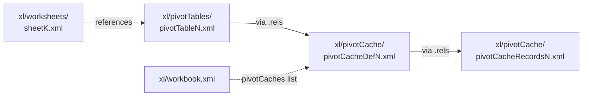

# Sprint Ν ("Nu") — pivot tables + pivot charts → v2.0.0

**Status**: In progress (kicked off post-v1.7.0, 2026-04-27).
**Target tag**: `v2.0.0`.
**Calendar**: ~3-4 weeks parallel-pod.
**Predecessor**: v1.7.0 (Sprint Ξ launch slice; tag `406a3d5`).
**Successor**: v2.1.x (slicers, calculated fields, GroupItems, OLAP).

## Why this sprint exists

After v1.7.0 the only construction-side row left in
`tests/parity/KNOWN_GAPS.md` is **pivot tables and pivot charts**.
Sprint Ν closes it. After this sprint the marketing claim shifts
from "openpyxl parity for the 95th-percentile case" to
**"full openpyxl replacement, period."**

User picked **Option A** (full pivot construction including
`pivotCacheRecords` emit) on 2026-04-27 over the 80/20
"refresh-on-open" variant. Reasoning: the marketing claim
requires that pivot tables work without an Excel-side refresh
round-trip — i.e. open the wolfxl-emitted workbook in any
OOXML-compliant reader (openpyxl, calamine, LibreOffice) and
the pivot's data is already populated. That requires authoring
the records snapshot.

## OOXML pivot anatomy

Three XML parts make up a pivot:

- **`xl/pivotCache/pivotCacheDefinition{N}.xml`** — schema:
  source range pointer, list of `CacheField`s (one per source
  column), with each field's `SharedItems` enumeration of
  unique values. Connected to records via the cache's rels.
- **`xl/pivotCache/pivotCacheRecords{N}.xml`** — denormalised
  rectangular snapshot: one `<r>` per source-data row, each
  `<r>` has one child per field. Children can be `<x v="N"/>`
  (index into SharedItems) or inline `<n v=42/>`/`<s v="text"/>`
  for non-shared values.
- **`xl/pivotTables/pivotTable{N}.xml`** — layout: which fields
  go on rows / cols / data / page; aggregator (sum / count / avg
  / min / max); `<rowItems>` / `<colItems>` enumerate the
  pre-computed pivot row/col labels Excel renders without
  recomputing.
- **`xl/workbook.xml`** — `<pivotCaches>` collection, one entry
  per cache.

## In-scope (Option A)

### Code (Pods α / β / γ / δ)

1. **Rust pivot model + emit** (RFC-047 + RFC-048; Pod-α)
   * New crate `crates/wolfxl-pivot` (matches the
     `wolfxl-rels`, `wolfxl-formula`, `wolfxl-structural`
     pattern — PyO3-free).
   * `model::PivotCache`, `model::PivotTable`,
     `model::PivotField`, `model::DataField`,
     `model::SharedItems`, `model::CacheField`,
     `model::CacheRecord`, `model::Reference`.
   * `emit::pivot_cache_xml(c: &PivotCache, w: &mut Writer)`.
   * `emit::pivot_records_xml(c: &PivotCache, w: &mut Writer)`.
   * `emit::pivot_table_xml(t: &PivotTable, w: &mut Writer)`.
   * PyO3 bindings: `wolfxl._rust.serialize_pivot_cache_dict`,
     `wolfxl._rust.serialize_pivot_records_dict`,
     `wolfxl._rust.serialize_pivot_table_dict`.

2. **Python `wolfxl.pivot.*` module** (RFC-047 + RFC-048; Pod-β)
   * `wolfxl.pivot.PivotTable` — replaces the `_make_stub`.
   * `wolfxl.pivot.PivotCache` — new.
   * `wolfxl.pivot.PivotField`, `DataField`, `RowField`,
     `ColumnField`, `PageField`.
   * `wolfxl.pivot.Reference` — re-exports
     `wolfxl.chart.Reference` since the shape is identical.
   * Per-class `to_rust_dict()` methods that emit the §10
     contract verbatim.
   * Construction-time validation per RFC-047/048 §10.11
     (empty fields, bad source range, unknown aggregator,
     etc.).

3. **Patcher integration** (RFC-047 + RFC-048; Pod-γ)
   * `XlsxPatcher.queue_pivot_cache_add(cache_def_xml,
     cache_records_xml)`.
   * `XlsxPatcher.queue_pivot_table_add(sheet, table_xml,
     anchor_a1)`.
   * Phase 2.5m: drain queued pivot adds; allocate fresh
     `pivotCache{N}.xml` and `pivotTable{N}.xml` numbers via
     `PartIdAllocator`; emit through `file_adds`; splice
     `<pivotCaches>` into `xl/workbook.xml`; splice
     `<pivotTables>` into the sheet's rels graph.
   * `Worksheet.add_pivot_table(pt, anchor)` — public API.
   * `Workbook.add_pivot_cache(cache)` — public API.

4. **RFC-035 `copy_worksheet` extension** (RFC-047 §6; Pod-γ)
   * Lifts the "sheets with pivot tables raise a clear error"
     limit from RFC-035 §10.
   * Deep-clone pivot table parts; alias pivot cache (one
     cache can serve many pivot tables, like the existing
     image-media aliasing).
   * Cell-range re-pointing on the pivot's source-range hint
     (matches the chart deep-clone pattern from v1.6 / Sprint Μ).

5. **Pivot-chart linkage** (RFC-049; Pod-δ)
   * `chart.pivot_source = pt` on existing 16 chart families.
   * Adds `<c:pivotSource>` block at the start of
     `<c:chart>` element.
   * Sets `<c:fmtId>` on each series.
   * Touches `crates/wolfxl-writer/src/emit/charts.rs` and
     `python/wolfxl/chart/_chart.py`.

### Docs (Pod-ε)

6. **`docs/migration/`** — pivot-table walkthrough section in
   `openpyxl-migration.md`; flip "Pivot table construction"
   to "Supported" in `compatibility-matrix.md`.
7. **`docs/release-notes-2.0.md`** — full release notes.
8. **`CHANGELOG.md`** — prepend v2.0.0 entry.
9. **`tests/parity/KNOWN_GAPS.md`** — close out pivot row;
   "Out of scope" section now lists only slicers /
   calculated fields / GroupItems / OLAP (deferred to v2.1+).
10. **`README.md`** rewrite — drop "for the 95th-percentile
    case" qualifier; promote to "full openpyxl replacement".
11. **`Plans/launch-posts.md`** — finalize from Sprint Ξ
    drafts.

### Release artifacts (Integrator)

12. **`pyproject.toml` + `Cargo.toml` → `2.0.0`**.
13. **`Plans/rfcs/INDEX.md`** — add 047 / 048 / 049 / 054 rows.
14. **Tag `v2.0.0`** after `cargo test --workspace` and
    `pytest` are green.
15. **`maturin publish`** to PyPI.

## Out of scope (deferred to v2.1+)

- **Slicers** (`xl/slicers/`, `xl/slicerCaches/`). Separate
  XML namespace, complex slicer-cache-shared-with-pivot-cache
  wiring. → v2.1.
- **Calculated fields** (`<calculatedField>`). Formula
  expressions in the pivot's field list. → v2.1.
- **Calculated items** (`<calculatedItem>`). Formula
  expressions inside row/col fields. → v2.1.
- **GroupItems** (date / range grouping —
  `<fieldGroup base="N"><rangePr><groupItems/></rangePr></fieldGroup>`).
  Non-trivial recursion. → v2.1.
- **OLAP / external pivot caches**. Needs the PowerPivot
  data-model (`xl/model/`). → never; out of scope permanently.
- **Pivot-table styling beyond the named-style picker**.
  Themes, banded formats, conditional formatting on pivots.
  → v2.1.
- **Pivot-table updates in modify mode** beyond
  `add_pivot_table`. Editing an existing pivot's source range,
  field ordering, etc. → v2.2.

## RFCs

| RFC | Title | Pod | Estimate |
|---|---|---|---|
| 047 | Pivot caches — `wolfxl.pivot.PivotCache` + cache definition + records emit | α + β + γ | XL |
| 048 | Pivot tables — `wolfxl.pivot.PivotTable` + layout + RFC-035 ext | α + β + γ | XL |
| 049 | Pivot-chart linkage — `chart.pivot_source = pt` | δ | M |
| 054 | v2.0.0 launch hardening + docs + README rewrite | ε | M |

RFC-047 and RFC-048 are bundled because the cache and table
contracts cross-reference (cache fields → table fields by
index); splitting them across pods would re-introduce the
Sprint Μ contract-gap problem.

## Pod plan

5 parallel pods + integrator. Sequential merge order:
α → β → γ → δ → ε. Pod-ε can scaffold in parallel with
α/β/γ/δ (lessons #3, #8 — doc pods scaffold with TBD
markers).

| Pod | Branch | Deliverable |
|---|---|---|
| α | `feat/sprint-nu-pod-alpha` | Rust `wolfxl-pivot` crate; PyO3 bindings; cargo unit tests |
| β | `feat/sprint-nu-pod-beta`  | Python `wolfxl.pivot.*` module; per-class `to_rust_dict`; construction validation; pytest |
| γ | `feat/sprint-nu-pod-gamma` | Patcher Phase 2.5m; `Worksheet.add_pivot_table` / `Workbook.add_pivot_cache`; RFC-035 deep-clone extension |
| δ | `feat/sprint-nu-pod-delta` | Chart `pivot_source` linkage; chart-XML extension |
| ε | `feat/sprint-nu-pod-epsilon` | Docs + launch artifacts; ratchet flips |
| Integrator | `feat/native-writer` | Pre-dispatch contract spec (RFC-047/048 §10); sequential merge; reconciliation pass; v2.0.0 tag |

## Pre-dispatch contract spec (Sprint Μ-prime lesson #12)

Before any pod opens a worktree, integrator authors:

- **RFC-047 §10** — `pivot_cache_dict` shape.
- **RFC-047 §10b** — `pivot_records_dict` shape.
- **RFC-048 §10** — `pivot_table_dict` shape.

Both Pod-α (Rust parser) and Pod-β (Python emitter) code to
those §10 specs verbatim. This is the single biggest delta
from Sprint Μ → Μ-prime debt.

## Acceptance criteria

1. `wolfxl.pivot.PivotTable(...)` constructs without
   `NotImplementedError` (replaces the v0.5+ `_make_stub`).
2. `Worksheet.add_pivot_table(pt, anchor)` emits a workbook
   that opens in **Excel and LibreOffice and openpyxl**, with
   the pivot's data populated (without requiring refresh).
3. `chart.pivot_source = pt` produces a chart linked to the
   pivot; chart emits `<c:pivotSource>` block.
4. `wb.copy_worksheet(ws)` of a sheet with a pivot table
   succeeds (no longer raises) and the cloned pivot
   round-trips.
5. `tests/parity/openpyxl_surface.py`:
   `wolfxl.pivot.PivotTable` flips to
   `wolfxl_supported=True`.
6. `tests/parity/KNOWN_GAPS.md` "Out of scope" lists only
   slicers / calculated fields / GroupItems / OLAP / pivot
   styling.
7. `pyproject.toml` and `Cargo.toml` → `2.0.0`.
8. `cargo test --workspace --exclude wolfxl` green.
9. `pytest tests/` + `pytest tests/parity/` green.
10. README.md rewritten with "full openpyxl replacement"
    headline.
11. `git tag v2.0.0` cut.
12. `maturin publish` succeeded; `pip install wolfxl==2.0.0`
    installs on PyPI.
13. Launch posts (HN, Twitter/X, r/Python, dev.to, GH
    Discussions) go live.

## Calendar

| Day(s) | Activity |
|---|---|
| 0 | Integrator: RFC-047 / RFC-048 / RFC-049 / RFC-054 + §10 contract specs (pre-dispatch) |
| 1-10 | Pods α / β / γ / δ / ε in parallel worktrees |
| 11-14 | Sequential merge α → β → γ → δ → ε |
| 15-16 | Integrator finalize: contract reconciliation, version bump, ratchet flip, tag v2.0.0 |
| 17 | PyPI publish + launch posts go live |

~2.5-3 weeks calendar (Option A; with the parallel-pod
pattern this runs faster than the sequential 4-week estimate).

## Lessons applied

- Pre-dispatch contract spec (Sprint Μ-prime lesson #12)
- Strict xfail = bug receipt (lesson #1)
- PartIdAllocator centralization (lesson #2)
- Doc-only pod scaffolds with `<!-- TBD: SHA -->` markers (lesson #3)
- Worktree pattern (lesson #8)
- Optional deps need test-time install handling (lesson #6) —
  no new optional deps in Sprint Ν.

## Risk register

| # | Risk | Mitigation |
|---|---|---|
| 1 | `pivotCacheRecords` emit. Excel's "valid records" rules are loose but openpyxl's are strict; mismatch could cause Excel "PivotTable references invalid data" warning. | Pin RFC-047 §10b records-dict contract from a known-working openpyxl-emitted fixture. Parity test: `pandas.read_excel(engine="openpyxl")` reads our pivot's source range correctly. |
| 2 | `TableDefinition` has 69 attrs. Coverage decisions are subjective. | RFC-048 §3 pins a "v2.0 supported attrs" list — start with the 25 attrs openpyxl users actually set in the wild. Defer the rest to v2.1 with explicit ratchet entries. |
| 3 | `chart.pivot_source` linkage requires a `<c:pivotSource>` block in chart XML — touches v1.6 chart emit pipeline. | RFC-049 is small extension, not rewrite. Pod-δ touches `crates/wolfxl-writer/src/emit/charts.rs` and adds new `model::PivotSource`. |
| 4 | Modify-mode `add_pivot_table` on a workbook with existing pivots needs ID allocation against existing pivotCache list. | Use existing `PartIdAllocator` pattern from RFC-035 / RFC-046. |
| 5 | RFC-035 `copy_worksheet` of pivot-bearing sheet currently raises. v2.0 lifts the limit — must avoid regressions on the cloned-tables path. | Pod-γ extends RFC-035 deep-clone with pivot handling, mirroring chart-deep-clone path. Existing 6 RFC-035 cross-RFC composition tests stay green. |
| 6 | Public-launch reputation risk. Bugs found post-launch are amplified. | Pod-ε ships with an exhaustive test-fixture matrix — every openpyxl pivot-table example fixture round-trips. |
