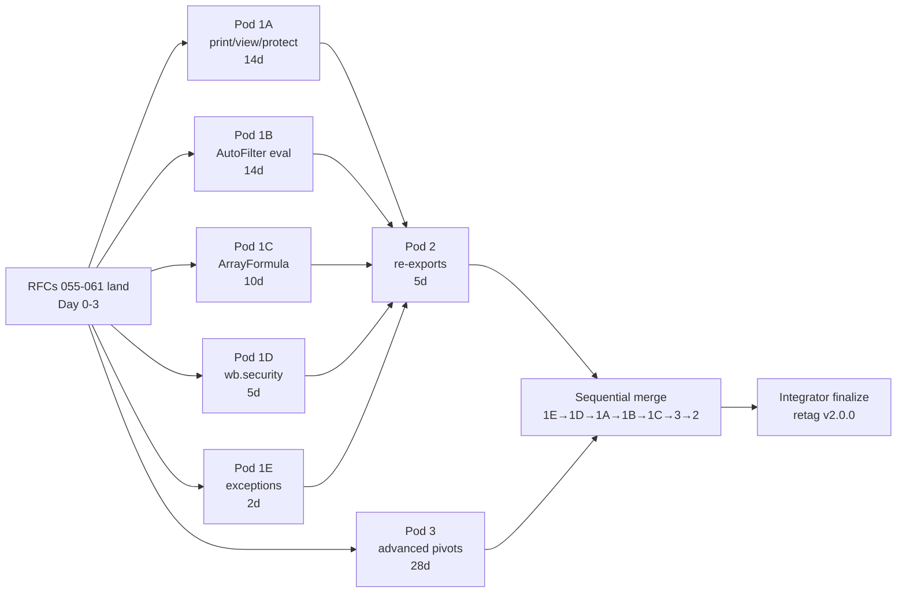

# Sprint Ο ("Omicron") — Tier 1 + Tier 2 + Tier 3 closure pre-v2.0.0

> **Status**: Approved. Dispatched 2026-04-27.
> **Baseline**: `feat/native-writer` @ `224de29` (Sprint Ν integrator finalize, v2.0.0 tag REVOKED locally).
> **Goal**: Close every user-visible openpyxl gap surfaced by the post-Sprint-Ν audit so v2.0.0 can credibly claim "Full openpyxl replacement, drop-in compatible."
> **User scope decisions**: Tier 3 scope (a) (no OLAP); AutoFilter eval in patcher; delete v2.0.0 tag and re-cut after expanded scope; no calendar ceiling.

## Why

Sprint Ν shipped pivot construction + chart linkage and the
README headline rewrite to "Full openpyxl replacement, drop-in
compatible, 10×–100× faster." A post-tag audit walked openpyxl's
public surface against wolfxl and found 232 user-facing symbols,
of which a meaningful subset was missing:

- **Tier 1** — 6 user-facing features that fail real code:
  `ws.page_setup`, `ws.page_margins`, `ws.header_footer`,
  `ws.print_title_rows`, `ws.sheet_view`, `ws.protection`,
  AutoFilter conditions, ArrayFormula, wb.security,
  IndexedList/exceptions.
- **Tier 2** — ~70 class re-export paths so
  `from openpyxl.X import Y` swaps to `from wolfxl.X import Y`.
- **Tier 3** — advanced pivot construction (slicers, calc
  fields, calc items, GroupItems, pivot styling).

The user opted to roll all three Tiers into v2.0.0 rather than
ship today and follow-up in v2.1.

## RFCs

| RFC | Pod | LOC est. | Calendar | Status |
|---|---|---|---|---|
| 055 — Print / view / sheet protection | 1A | 1500 | 14d | Approved |
| 056 — AutoFilter conditions + eval | 1B | 2500 | 14d | Approved |
| 057 — Array / DataTable formulas | 1C | 1200 | 10d | Approved |
| 058 — Workbook-level security | 1D | 400 | 5d | Approved |
| 059 — Public exceptions + IndexedList | 1E | 300 | 2d | Approved |
| 060 — openpyxl-shaped class re-exports | 2 | 600 | 5d | Approved |
| 061 — Advanced pivot construction | 3 | 4500 | 28d | Approved |

Total LOC: ~11,000. Total test count: ~360 new tests.

## Mermaid

## Worktree map

| Pod | Worktree | Branch |
|---|---|---|
| 1A | `../wolfxl-worktrees/sprint-omicron-pod-1a` | `feat/sprint-omicron-pod-1a` |
| 1B | `../wolfxl-worktrees/sprint-omicron-pod-1b` | `feat/sprint-omicron-pod-1b` |
| 1C | `../wolfxl-worktrees/sprint-omicron-pod-1c` | `feat/sprint-omicron-pod-1c` |
| 1D | `../wolfxl-worktrees/sprint-omicron-pod-1d` | `feat/sprint-omicron-pod-1d` |
| 1E | `../wolfxl-worktrees/sprint-omicron-pod-1e` | `feat/sprint-omicron-pod-1e` |
| 2  | `../wolfxl-worktrees/sprint-omicron-pod-2`  | `feat/sprint-omicron-pod-2`  |
| 3  | `../wolfxl-worktrees/sprint-omicron-pod-3`  | `feat/sprint-omicron-pod-3`  |

Pod 2 dispatches AFTER Pods 1A-1E land (depends on their classes).
Pod 3 runs in parallel with Pods 1A-1E.

## Calendar (target)

| Day | Activity |
|---|---|
| 0 | RFCs 055-061 land + this plan + worktrees created |
| 1-14 | Pods 1A / 1B / 1C / 1D / 1E / 3 in parallel |
| 14 | Pods 1D / 1E land first (smallest); merge to integrator |
| 14-19 | Pod 2 dispatches off integrator (depends on 1A-1E classes) |
| 14-28 | Pods 1A / 1B / 1C / 3 continue |
| 28-32 | Sequential merge order: 1E → 1D → 1A → 1B → 1C → 3 → 2 |
| 32-34 | Integrator finalize: §10 reconciliation, ratchet flips, version-bump verification |
| 34 | `git tag v2.0.0` at the new finalize commit |
| 35 | `maturin publish` x86_64/aarch64 linux+darwin+windows |
| 36 | Public launch sequence per Plans/launch-posts.md |

~5 weeks calendar with the longest tail being Pod 3 (~28 days).

## Risk register

| # | Risk | Mitigation |
|---|---|---|
| 1 | AutoFilter eval edge cases (Top10 rounding, dynamic-filter date arithmetic) | Pin against Excel 365 fixture corpus first; openpyxl is reference for XML byte equality only |
| 2 | Slicer XML extLst URI ordering (Excel rejects out-of-order) | RFC-061 §10 pins ordering; byte-stable golden tests |
| 3 | RFC-035 deep-clone interaction with new sheet-scoped page setup / views | Pod 1A extends `sheet_copy.rs`; cross-RFC composition tests pin the contract |
| 4 | Re-export shim path collisions with existing wolfxl modules | Audit before pod 2 dispatch; fall back to `wolfxl.openpyxl_compat.*` namespace if collisions |
| 5 | Pod 3 calendar slip (28 days is optimistic for 5 sub-features) | Sub-features run sequentially within Pod 3; pivot styling (3.5) is the safest deferral candidate (already-shipped named-style picker covers 90% of users) |
| 6 | Pod 2 depends on Pods 1A-1E — merge ordering risk | Pod 2 dispatches AFTER Pods 1A-1E land, not in parallel. Adds 5 days serial dependency; budget reflects this. |
| 7 | AutoFilter Phase 2.5o ordering vs CF Phase 2.5g | RFC-056 §5 pins: AutoFilter runs BEFORE CF; rows hidden by AutoFilter remain hidden regardless of CF |
| 8 | Slicer cache aliasing on RFC-035 deep-clone | RFC-061 §6 documents: slicer caches are workbook-scoped (alias); slicer presentations are sheet-scoped (deep-clone with cache_id preserved). Mirrors pivot cache vs pivot table split. |

## Out of scope (deferred to v2.1+ — confirmed by user)

- OLAP / external pivot caches (`xl/model/`, PowerPivot)
- In-place pivot edits in modify mode beyond `add_*`
- Pivot table runtime evaluation (calc-field values pre-computed
  into records — Excel computes on open)
- `&G` picture in header/footer body (round-trip bytes only)
- Page break write-side feature (Pod 2 ships read-side classes
  only)
- SortState physical row reordering (XML round-trip only in v2.0)

## Acceptance criteria (the v2.0 gate)

1. The post-Sprint-Ν audit script reports **zero** Tier 1 gaps.
2. The audit reports **zero** Tier 3 gaps from scope (a).
3. `from openpyxl.X import Y` → `from wolfxl.X import Y` works for
   every path in RFC-060's current 211-pair map.
4. `tests/parity/test_openpyxl_path_compat.py` covers the current
   211 `(path, symbol)` pairs.
5. `pytest tests/` total ~1600 green.
6. `cargo test --workspace --exclude wolfxl` ~900 green.
7. README headline claim defensible: "Full openpyxl replacement,
   drop-in compatible, 10×–100× faster" backed by surface-coverage
   table.
8. KNOWN_GAPS.md "Out of scope" reduces to:
   slicer-runtime-evaluation + OLAP + in-place pivot edits +
   page break write API + SortState physical reorder.
9. `wolfxl.__version__ == "2.0.0"` and `git tag v2.0.0` at new
   finalize commit.
10. `pip install wolfxl==2.0.0` works on all 5 wheel targets.

## Lessons applied

- #3 Doc-pod scaffolds with TBD markers
- #5 Integrator finalize commit reconciles drift
- #7 Two-step ratchet flip
- #8 Worktree pattern for 6+ parallel pods
- #11 Pre-dispatch contract pinning (RFCs 055-061 §10)
- #12 Pre-dispatch §10 in RFCs eliminates integrator-time reconciliation
- #14 Small-LOC slices (Pod 1D / 1E) integrator-inline; large slices parallel worktrees
- #16 openpyxl class-version drift requires duck-typing in re-export shims
