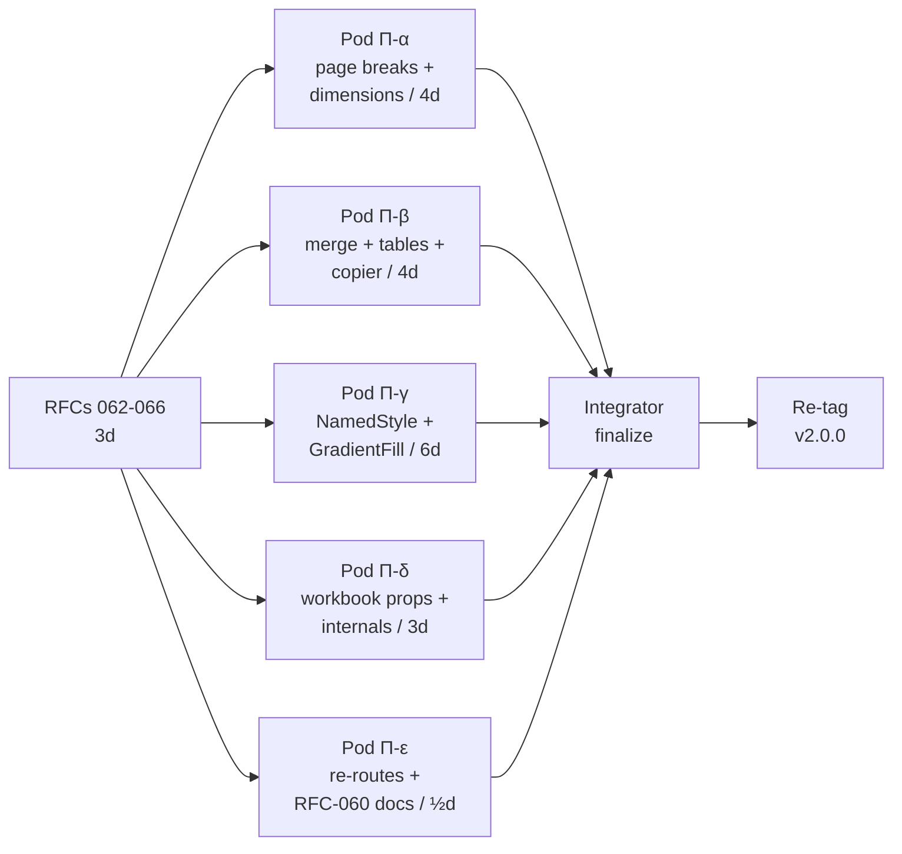

# Sprint Π ("Pi") — Tier-1.5 stub closure pre-v2.0.0 ship

> **Status**: Pre-dispatch.
> **Baseline**: `feat/native-writer` @ `2e7d3d3` (Sprint Ο integrator finalize, v2.0.0 tag at this SHA — to be deleted on closure).
> **Goal**: Close all 26 Pod-2 construction stubs to **full parity** (Python construction + state + save() round-trip) so v2.0.0 ships without ANY `NotImplementedError` on documented openpyxl import paths.
> **User scope decisions**: Full parity + include all 7 internal stubs + re-cut v2.0.0 at closure SHA.

## Why

The post-Sprint-Ο audit surfaced 26 stubs in Pod 2's RFC-060 path
shims. Three of them (`wolfxl.worksheet.page.{PageMargins,
PrintOptions, PrintPageSetup}`) have real implementations elsewhere
that just need re-routing — quick fix. The other 23 are genuine
construction gaps that contradict the v2.0.0 README headline of
"Full openpyxl replacement, drop-in compatible".

Sprint Π closes every stub to full parity:
- Python class with all openpyxl-documented attributes
- State storage on the owning model
- Rust emit (where applicable)
- Patcher drainage (where applicable)
- RFC-035 deep-clone (where applicable)
- Round-trip parity tests

## RFCs

| RFC | Pod | Stubs | LOC est. | Calendar | Status |
|---|---|---|---|---|---|
| 062 — Page breaks + dimensions | Π-α | 6 | 1200 | 4d | Pending |
| 063 — Merge + tables + copier | Π-β | 7 | 1100 | 4d | Pending |
| 064 — Styles (NamedStyle + Gradient + Protection + DifferentialStyle + Fill) | Π-γ | 5 | 2100 | 6d | Pending |
| 065 — Workbook props + internals | Π-δ | 5 | 900 | 3d | Pending |
| 066 — Re-routes + RFC-060 doc cleanup | Π-ε | 3 + docs | 50 | ½d | Pending |

Total: ~5350 LOC + ~1000 LOC tests. ~250 new pytest cases. ~80 new cargo tests.

## Mermaid



## Patcher phase ordering (post-Sprint-Π)

Phase 2.5l drawings →
Phase 2.5m pivots →
Phase 2.5n sheet-setup →
**Phase 2.5r page breaks (NEW)** →
Phase 2.5p slicers →
Phase 2.5o autofilter →
Phase 2.5q workbook security →
Phase 2.5h sheet reorder →
Phase 3 cells

Pod Π-α inserts 2.5r between sheet-setup and slicers (page breaks
must land before slicers because slicer extLst entries can reference
break-anchored cells).

## Risk register

| Risk | Pod | Mitigation |
|---|---|---|
| `NamedStyle` cellStyleXfs collisions with Sprint-Ο Pod-3 dxf table | Π-γ | RFC-064 freezes the `Format` model interface; Pod-γ owns `wolfxl-writer/src/emit/styles.rs` |
| Phase 2.5r ordering vs Phase 2.5p slicers | Π-α | RFC-062 §6 documents sequence; integrator verifies at finalize |
| `uv run pytest` broken on this machine | All | Pod prompts mandate `uv run python -m pytest` |
| `_WorkbookChild` mixin breaks Worksheet/ChartSheet MRO | Π-δ | RFC-065 §3 — opt-in mixin via `isinstance` parity only, NO MRO injection |
| GradientFill XML emit collides with PatternFill in `<fills>` table | Π-γ | RFC-064 §5 — single fills table, type-tagged per entry |

## Verification gates

Each pod must clear before merge:
- `cargo build --workspace` clean
- `uv run python -m pytest <pod-specific-tests> -q` passes (no failures)
- Construction smoke for every closed stub
- Round-trip parity test (where applicable)

Integrator finalize:
- Full suite `uv run python -m pytest -q` (target: ~2370 passed, 0 failed)
- `cargo test --workspace --exclude wolfxl` (target: ~975 passed, 0 failed)
- Surface_smoke 67/67
- Construction-smoke walks all 26 paths
- RFC-060 §12 + §12.1 stale entries flipped to ✅

## v2.0.0 retag procedure

```sh
git tag -d v2.0.0                          # delete current annotated tag at 2e7d3d3
git tag -a v2.0.0 -m "..." <closure-SHA>   # retag at Sprint Π integrator finalize
```

## Deferrals

None planned — Sprint Π's mandate is "close all 26".

If a pod returns partial, dispatch a follow-up (Π-α.5 etc.) before
retagging — same pattern as Sprint Ο.
