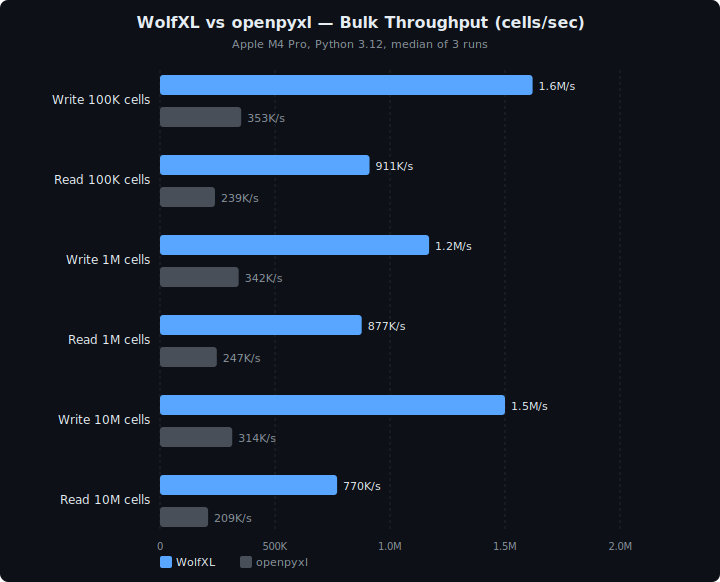

<p align="center">
  <h1 align="center">WolfXL</h1>
  <p align="center">
    <strong>Openpyxl-compatible Excel automation with a Rust backend.</strong><br>
    Read, write, and surgically modify workbooks, including charts, images, encryption, structural ops, and pivot-table construction.
  </p>
</p>

<p align="center">
  <a href="https://pypi.org/project/wolfxl/"></a>
  <a href="https://pypi.org/project/wolfxl/"></a>
  <a href="https://github.com/SynthGL/wolfxl/blob/main/LICENSE"></a>
  <a href="https://excelbench.vercel.app"></a>
</p>

---

## Openpyxl-style imports. One import change.

```diff
- from openpyxl import load_workbook, Workbook
- from openpyxl.styles import Font, PatternFill, Alignment, Border
+ from wolfxl import load_workbook, Workbook, Font, PatternFill, Alignment, Border
```

Most workbook automation keeps the same shape: `ws["A1"].value`,
`Font(bold=True)`, and `wb.save()` all work the way openpyxl users
expect.

---

<p align="center">
  <picture>
    <source media="(prefers-color-scheme: dark)" srcset="assets/benchmark-dark.svg">
    <source media="(prefers-color-scheme: light)" srcset="assets/benchmark-light.svg">
    
  </picture>
</p>

<p align="center">
  <sub>Fresh WolfXL 2.0 release-artifact evidence is available in ExcelBench:
  wheel-backed rerun, 18/18 green features, and dated performance snapshots.</sub>
</p>

## Current Evidence

- WolfXL package surface is at `2.0.0`.
- Current local verification is green: Rust workspace tests, Python package tests, and parity slices all pass in the 2026-04-28 audit.
- Fresh wheel-backed ExcelBench rerun is now available: WolfXL reached `18/18` green features with `100%` pass rate in the [release snapshot fidelity report](https://github.com/SynthGL/ExcelBench/blob/main/results-release-2026-04-28/README.md).
- The paired dated evidence includes the [release snapshot dashboard](https://github.com/SynthGL/ExcelBench/blob/main/results-release-2026-04-28/DASHBOARD.md) and the [matching perf snapshot](https://github.com/SynthGL/ExcelBench/blob/main/results-release-2026-04-28/perf/README.md).
- Use the [Public Evidence Status](docs/trust/public-evidence.md) page to see which claims are current, historical, or still gated.

## Install

```bash
pip install wolfxl
```

## Quick Start

```python
from wolfxl import load_workbook, Workbook, Font, PatternFill

# Write a styled spreadsheet
wb = Workbook()
ws = wb.active
ws["A1"].value = "Product"
ws["A1"].font = Font(bold=True, color="FFFFFF")
ws["A1"].fill = PatternFill(fill_type="solid", fgColor="336699")
ws["A2"].value = "Widget"
ws["B2"].value = 9.99
wb.save("report.xlsx")

# Read it back — styles included
wb = load_workbook("report.xlsx")
ws = wb[wb.sheetnames[0]]
for row in ws.iter_rows(values_only=False):
    for cell in row:
        print(cell.coordinate, cell.value, cell.font.bold)
wb.close()
```

## Pivot tables through modify mode

```python
import wolfxl
from wolfxl.chart import Reference
from wolfxl.pivot import PivotCache, PivotTable

wb = wolfxl.load_workbook("source-data.xlsx", modify=True)
ws = wb.active
src = Reference(ws, min_col=1, min_row=1, max_col=4, max_row=100)
cache = wb.add_pivot_cache(PivotCache(source=src))
pt = PivotTable(
    cache=cache, location="F2",
    rows=["region"], cols=["quarter"], data=[("revenue", "sum")],
)
ws.add_pivot_table(pt)
wb.save("pivot.xlsx")
```

WolfXL constructs pivot tables with **pre-aggregated records** —
pivots open in Excel, LibreOffice, and openpyxl with data populated,
through the modify-mode patcher (`load_workbook(..., modify=True)`),
with no refresh-on-open required. In the project comparison below, openpyxl
preserves pivots on round-trip but does not provide this constructor,
and XlsxWriter does not support pivots.

Link a chart to the pivot:

```python
from wolfxl.chart import BarChart

chart = BarChart()
chart.pivot_source = pt          # emits <c:pivotSource> + per-series <c:fmtId>
ws.add_chart(chart, "F18")
```

Existing pivots can be re-pointed at a new source range in modify mode (RFC-070 Option B); v1.0 covers source-range edits only — field placement, filter, and aggregation mutations are deferred.

## Three Modes

<p align="center">
  <picture>
    <source media="(prefers-color-scheme: dark)" srcset="assets/architecture-dark.svg">
    <source media="(prefers-color-scheme: light)" srcset="assets/architecture-light.svg">
    
  </picture>
</p>

| Mode | Usage | Engine | What it does |
|------|-------|--------|--------------|
| **Read** | `load_workbook(path)` | NativeXlsxBook | Parse XLSX with values, formulas, styles, metadata, drawings, and tables |
| **Write** | `Workbook()` | [rust_xlsxwriter](https://github.com/jmcnamara/rust_xlsxwriter) | Create new XLSX files from scratch |
| **Modify** | `load_workbook(path, modify=True)` | XlsxPatcher | Surgical ZIP patch — only changed cells are rewritten |

Modify mode preserves everything it doesn't touch: charts, macros, images, pivot tables, VBA.

## Supported Features

Features marked **Preserved** are kept verbatim on modify-mode round-trip (open, edit other cells, save). Construction from Python code for those features is tracked below as roadmap items.

| Category | Features |
|----------|----------|
| **Data** | Cell values (string, number, date, bool), formulas, comments, hyperlinks |
| **Styling** | Font (bold, italic, underline, color, size), fills, borders, number formats, alignment; `Color(theme=...)` and `Color(indexed=...)` accepted |
| **Structure** | Multiple sheets, merged cells, defined names (read + write), freeze panes, row heights, column widths, document properties |
| **Tables / Validation / CF** | `ws.tables`, `ws.add_table`, `ws.data_validations`, `ws.conditional_formatting` (read + write in `Workbook()` mode) |
| **Charts** | 16 chart families — `BarChart`, `LineChart`, `PieChart`, `DoughnutChart`, `AreaChart`, `ScatterChart`, `BubbleChart`, `RadarChart`, `BarChart3D`, `LineChart3D`, `PieChart3D`, `AreaChart3D`, `SurfaceChart`, `SurfaceChart3D`, `StockChart`, `ProjectedPieChart` |
| **Pivots** | `PivotCache`, `PivotTable`, `RowField` / `ColumnField` / `DataField` / `PageField`; slicers, calculated fields/items, GroupItems; pivot-chart linkage via `chart.pivot_source = pt`; deep-clone of pivot-bearing sheets |
| **Images** | `Image` (PNG / JPEG / GIF / BMP); one-cell, two-cell, absolute anchors; modify-mode `add_image` |
| **Encryption** | Read + write Agile (AES-256 / SHA-512) via `wolfxl[encrypted]` |
| **Iteration** | `iter_rows`, `iter_cols`, `rows`, `columns`, `values`, range slicing (`ws["A1:B2"]`, `ws["A:B"]`, `ws[1:3]`) |
| **Utils** | `get_column_letter`, `column_index_from_string`, `coordinate_to_tuple`, `range_boundaries`, `absolute_coordinate`, `quote_sheetname`, `range_to_tuple`, `rows_from_range`, `cols_from_range`, `get_column_interval`, `dataframe_to_rows`, `is_date_format` |
| **Preserved (read-only)** | Macros (VBA), embedded objects, external workbook links (`wb._external_links` exposes `target` / `sheet_names` / cached values; modify-save round-trips `xl/externalLinks/` byte-for-byte; authoring is not yet exposed) |

### openpyxl compatibility status

Modules that import from openpyxl generally work against wolfxl. Unsupported classes raise `NotImplementedError` with a clear hint at the construction site - no silent no-ops.

| Class / API | Status |
|-------------|--------|
| `Font`, `PatternFill`, `Border`, `Side`, `Alignment`, `Color` | Full support |
| `Comment`, `Hyperlink` | Read + write (write mode); modify-mode setters T1.5 |
| `DataValidation`, `Table`, `TableStyleInfo`, `TableColumn` | Read + write (write mode); modify-mode setters T1.5 |
| `CellIsRule`, `FormulaRule`, `ColorScaleRule`, `DataBarRule`, `IconSetRule` | Read + write (write mode); modify-mode setters T1.5 |
| `DefinedName`, `DocumentProperties` | Read + write (write mode); modify-mode setters T1.5 |
| `NamedStyle`, `Protection`, `GradientFill`, `DifferentialStyle` | Constructor / dataclass support |
| `BarChart`, `LineChart`, `PieChart`, `Reference`, `Series` (from `wolfxl.chart`) | **Full support** (1.6+) — 16 chart families incl. 3D / Stock / Surface / ProjectedPie |
| `Image` (from `wolfxl.drawing.image`) | **Full support** (1.5+) — PNG / JPEG / GIF / BMP, all anchor types |
| `PivotTable`, `PivotCache` (from `wolfxl.pivot`) | **Full support** (2.0+) — modify-mode construction + chart linkage + deep-clone |
| `AutoFilter` | Read + write support |
| `ws.insert_rows`, `ws.delete_rows` | **Full support** (modify mode, 1.1+) — RFC-030 |
| `ws.insert_cols`, `ws.delete_cols` | **Full support** (modify mode, 1.1+) — RFC-031 |
| `ws.move_range` | **Full support** (modify mode, 1.1+) — RFC-034 |
| `wb.move_sheet` | **Full support** (modify mode, 1.1+) — RFC-036 |
| `wb.copy_worksheet` | **Full support** (write + modify mode, 1.1+) — RFC-035 |

## Performance at Scale

The v2.0 benchmark table is intentionally withheld until the current
audit refreshes the ExcelBench run, pivot-construction microbenchmark,
and clean install/import smoke from the release artifact. Do not use
draft `10×-100×` marketing copy or placeholder benchmark rows as
release evidence.

For historical context and reproducible benchmark commands, see
[Benchmark Results](docs/performance/benchmark-results.md). For the
current claim status, see [Public Evidence Status](docs/trust/public-evidence.md).

The implementation goal remains stable throughput as files grow, with
linear pivot construction over source-row count.

## How WolfXL Compares

Every Rust-backed Python Excel project picks a different slice of the
problem. WolfXL is the only one in this comparison that covers all
four: formatting, modify mode, openpyxl API compatibility, and
pivot-table construction.

| Library | Read | Write | Modify | Styling | openpyxl API | Pivots |
|---------|:----:|:-----:|:------:|:-------:|:------------:|:------:|
| [fastexcel](https://github.com/ToucanToco/fastexcel) | Yes | — | — | — | — | — |
| [python-calamine](https://github.com/dimastbk/python-calamine) | Yes | — | — | — | — | — |
| [FastXLSX](https://github.com/shuangluoxss/fastxlsx) | Yes | Yes | — | — | — | — |
| [rustpy-xlsxwriter](https://github.com/rahmadafandi/rustpy-xlsxwriter) | — | Yes | — | Partial | — | — |
| [openpyxl](https://openpyxl.readthedocs.io/) | Yes | Yes | Yes (full DOM) | Yes | Native | Round-trip only* |
| [XlsxWriter](https://xlsxwriter.readthedocs.io/) | — | Yes | — | Yes | — | — |
| **WolfXL** | **Yes** | **Yes** | **Yes (surgical)** | **Yes** | **Yes** | **Yes (construction + linkage)** |

- **Styling** = reads and writes fonts, fills, borders, alignment, number formats
- **Modify** = open an existing file, change cells, save back — without rebuilding from scratch
- **openpyxl API** = same `load_workbook`, `Workbook`, `Cell`, `Font`, `PatternFill` objects
- **Pivots** = construct a pivot table from Python with pre-aggregated records (the file opens in Excel / LibreOffice / openpyxl with data populated, no refresh-on-open)

*openpyxl preserves pivot tables on round-trip but does not provide a
Python-side constructor that emits the `pivotCacheRecords` snapshot.
WolfXL's public ecosystem claim here is pending the final
public-launch truth pass.

WolfXL's public `.xlsx` and `.xlsb` readers are native. `.xlsb` is read-only but exposes values, cached formula results, and cell styles; legacy `.xls` remains on the Calamine-backed value path.

## Batch APIs for Maximum Speed

For write-heavy workloads, use `append()` or `write_rows()` instead of cell-by-cell access. These APIs buffer rows as raw Python lists and flush them to Rust in a single call at save time, bypassing per-cell FFI overhead entirely.

```python
from wolfxl import Workbook

wb = Workbook()
ws = wb.active

# append() — fast sequential writes (3.7x faster than cell-by-cell)
ws.append(["Name", "Amount", "Date"])
for row in data:
    ws.append(row)

# write_rows() — fast writes at arbitrary positions
ws.write_rows(header_grid, start_row=1, start_col=1)
ws.write_rows(data_grid, start_row=5, start_col=1)

wb.save("output.xlsx")
```

For reads, `iter_rows(values_only=True)` uses a fast bulk path that
reads all values in a single Rust call. Historical ExcelBench numbers
are shown below; the v2.0 release audit is refreshing them before any
new public speedup headline is made.

```python
wb = load_workbook("data.xlsx")
ws = wb[wb.sheetnames[0]]
for row in ws.iter_rows(values_only=True):
    process(row)  # row is a tuple of plain Python values
```

For ingestion, dataframe, or review workflows that need values plus formatting
signals, use `cell_records()`. It returns compact dictionaries without creating
one Python `Cell` object per coordinate:

```python
records = ws.cell_records(
    include_format=True,
    include_formula_blanks=False,
    include_coordinate=False,
)

for record in records:
    print(record["row"], record["column"], record["value"], record.get("number_format"))
```

| API | Last audited vs openpyxl | How |
|-----|-------------|-----|
| `ws.append(row)` | **3.7x** faster write | Buffers rows, single Rust call at save |
| `ws.write_rows(grid)` | **3.7x** faster write | Same mechanism, arbitrary start position |
| `ws.iter_rows(values_only=True)` | **6.7x** faster read | Single Rust call, no Cell objects |
| `ws.cell_records()` | Fast styled sparse read | Single Rust call, values plus compact format metadata |
| `ws.cell(r, c, value=v)` | **1.6x** faster write | Per-cell FFI (compatible but slower) |

## Formula Engine

WolfXL includes a **built-in formula evaluator** with 62 functions across 7 categories. Calculate formulas without external dependencies - no need for `formulas` or `xlcalc`.

```python
from wolfxl import Workbook
from wolfxl.calc import calculate

wb = Workbook()
ws = wb.active
ws["A1"] = 100
ws["A2"] = 200
ws["A3"] = "=SUM(A1:A2)"
ws["B1"] = "=PMT(0.05/12, 360, -300000)"  # monthly mortgage payment

results = calculate(wb)
print(results["Sheet!A3"])  # 300
print(results["Sheet!B1"])  # 1610.46...

# Recalculate after changes
ws["A1"] = 500
results = calculate(wb)
print(results["Sheet!A3"])  # 700
```

| Category | Functions |
|----------|-----------|
| **Math** (10) | SUM, ABS, ROUND, ROUNDUP, ROUNDDOWN, INT, MOD, POWER, SQRT, SIGN |
| **Logic** (5) | IF, AND, OR, NOT, IFERROR |
| **Lookup** (7) | VLOOKUP, HLOOKUP, INDEX, MATCH, OFFSET, CHOOSE, XLOOKUP |
| **Statistical** (13) | AVERAGE, AVERAGEIF, AVERAGEIFS, COUNT, COUNTA, COUNTIF, COUNTIFS, MIN, MINIFS, MAX, MAXIFS, SUMIF, SUMIFS |
| **Financial** (7) | PV, FV, PMT, NPV, IRR, SLN, DB |
| **Text** (13) | LEFT, RIGHT, MID, LEN, CONCATENATE, UPPER, LOWER, TRIM, SUBSTITUTE, TEXT, REPT, EXACT, FIND |
| **Date** (8) | TODAY, DATE, YEAR, MONTH, DAY, EDATE, EOMONTH, DAYS |

Named ranges are resolved automatically. Error values (`#N/A`, `#VALUE!`, `#DIV/0!`, `#REF!`, `#NUM!`, `#NAME?`) propagate through formula chains like real Excel. Install `pip install wolfxl[calc]` for extended formula coverage via the `formulas` library fallback.

## Case Study: SynthGL

[SynthGL](https://github.com/SynthGL) switched from openpyxl to WolfXL for their GL journal exports (14-column financial data, 1K-50K rows). Results: **4x faster writes**, **9x faster reads** at scale. 50K-row exports dropped from 7.6s to 1.3s. [Read the full case study](docs/case-study-synthgl.md).

## Case Study: Finance Template Modify Mode

For a representative finance workflow, see
[Template-Driven Finance Workbook Updates](docs/case-study-finance-template-modify.md).
It benchmarks the exact workload where WolfXL is most differentiated:
open an existing workbook with formulas, charts, comments, validations,
and large detail sheets, touch three assumption cells, and save.

## Case Study: Styled Report Generation

For a fresh-workbook export path, see
[Styled Report Generation](docs/case-study-styled-report-generation.md).
The current local snapshot on a 10k-row reporting workbook came in at
`0.553s` for `openpyxl` vs `0.380s` for WolfXL, about `1.46x` faster.

## Case Study: Workbook-Preserving ETL

For the "update one data block but keep the workbook" workflow, see
[Workbook-Preserving ETL Update](docs/case-study-workbook-preserving-etl.md).
The current local snapshot for replacing a `2,000`-row block inside a
`20,000`-row reporting workbook came in at `1.064s` for `openpyxl` vs
`0.496s` for WolfXL, about `2.15x` faster.

## Case Study: Pivot Construction

For a capability-first example, see
[Pivot Construction From Python](docs/case-study-pivot-construction.md).
It demonstrates workbook-scoped pivot cache creation, pivot-table emit,
and pivot-linked chart output through WolfXL modify mode.
The current local snapshot constructed the full artifact on a `10,000`-row
source sheet in `0.229s` median with emitted pivot cache, pivot records,
pivot table, and chart `<c:pivotSource>` parts all validated.

## How It Works

WolfXL is a thin Python layer over compiled Rust engines, connected via [PyO3](https://pyo3.rs/). The Python side uses **lazy cell proxies** — opening a 10M-cell file is instant. Values and styles are fetched from Rust only when you access them. On save, dirty cells are flushed in one batch, avoiding per-cell FFI overhead.

## License

MIT
